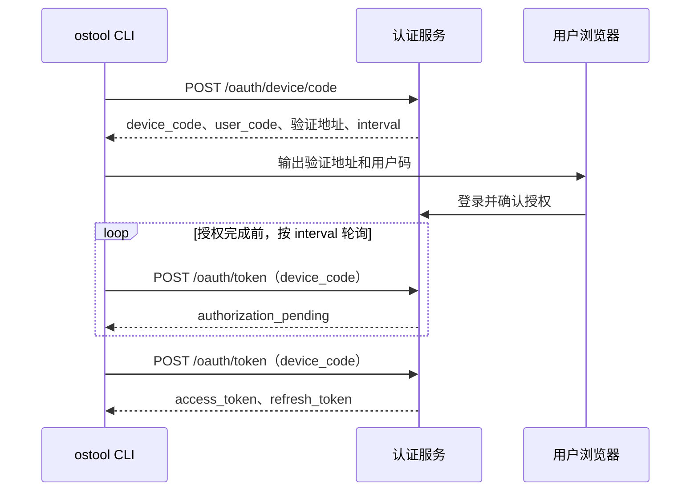

# `ostool` 后端服务 API

`ostool` 同时支持认证模式和本地局域网模式，两种模式连接不同的后端：

- 本地局域网模式使用 `auth_mode = "disabled"`，`ostool` 直接连接 `ostool-server`。`ostool-server` 提供 Board REST API、串口 WebSocket、Management API 和管理后台，不提供登录认证功能。
- 认证模式使用 `auth_mode = "required"`，`ostool` 连接独立的认证后端。该后端提供 OAuth Device Authorization API，并以相同的 Board REST 和串口 WebSocket 契约提供受认证的开发板服务。

本文同时记录上述两类后端使用的接口契约，并不表示单个后端实现文中的全部接口。`ostool` CLI 只调用 OAuth、Board REST 和串口 WebSocket；`/api/v1/admin/...` 及管理后台属于 `ostool-server`，供本地管理使用。

服务地址来自全局或项目配置中的 `board.server`（完整 URL，可包含路径前缀），可被命令行 `--server` 覆盖；可选的 `board.port` 或 `--port` 用于覆盖 URL 中的端口。`auth_mode = "disabled"` 时该地址指向局域网 `ostool-server`；`auth_mode = "required"` 时该地址指向认证后端，OAuth 和受认证的 Board API 共用这个 Base URL。为兼容旧的局域网配置，`board.server` 为裸 IPv4 或 IPv6 地址时客户端自动补为 `http://`。基线版本写出的 `board.server_ip` / `board.port` 也会在读取时迁移为 `board.server` / `board.port`，下一次保存配置时只写新格式；无 scheme 的主机名不支持。

客户端会先把 Base URL 规范化为以 `/` 结尾，再将 HTTP 和 OAuth 接口路径追加到该路径。本文为简洁起见把接口写成 `/api/...` 或 `/oauth/...`；这些是相对于 Base URL 的接口标识，不表示实际请求必须位于域名根目录。例如 Base URL 为 `https://board.example.com/webapp/ostoolmanagephp/` 时，创建会话的实际 URL 是 `https://board.example.com/webapp/ostoolmanagephp/api/v1/sessions`。

- `auth_mode = "required"` 时，`board.server` 必须使用 HTTPS，Board REST 请求和串口 WebSocket 握手携带下文描述的 Bearer Token；OAuth Device Authorization、Token 和撤销请求不携带该 Header；
- `auth_mode = "disabled"`（默认）时通常使用 HTTP，不会发送认证 Header，适合局域网直连 `ostool-server`。

## 通用认证规则

当 `auth_mode = "required"` 时，所有下列 board HTTP 请求和串口 WebSocket 握手均携带：

```http
Authorization: Bearer <access_token>
```

Access Token 选择规则：

1. `OSTOOL_BOARD_ACCESS_TOKEN` 非空时优先使用；该值不保存也不刷新；
2. 否则读取当前 endpoint 保存的一条本地凭据：PAT 直接使用，OAuth Access Token 剩余有效期超过 60 秒时直接使用；
3. OAuth Access Token 剩余有效期不超过 60 秒时，使用保存的 Refresh Token 刷新后再发送请求。

HTTP 客户端不跟随重定向。认证模式下，绝对 WebSocket URL 必须使用 Base URL 对应的 WebSocket scheme（HTTP 对应 `ws`，HTTPS 对应 `wss`），并与 Base URL 使用相同的 host 和有效端口。

## 命令索引

表中未写全的会话路径均以 `/api/v1/sessions/{session_id}` 为前缀。

| 命令 | 基本功能 | `auth_mode = "required"` 时的行为 | 涉及 API |
| --- | --- | --- | --- |
| `ostool login [--server URL] [--port PORT]` | 发起浏览器 Device Authorization 登录。 | 保存 OAuth 凭据；未指定 `--server` 时使用全局 board 配置。 | `POST /oauth/device/code`；`POST /oauth/token`（Device Code 轮询） |
| `ostool login --with-token [--server URL] [--port PORT]` | 从标准输入导入 PAT。 | 保存 PAT；不刷新该 Token。 | 无网络 API |
| `ostool auth status [--server URL] [--port PORT]` | 显示当前 endpoint 的认证状态。 | 显示凭据类型、已知过期时间和 scope，不显示 Token。 | 无网络 API |
| `ostool logout [--server URL] [--port PORT]` | 退出登录。 | OAuth 凭据会尝试远端撤销；随后删除本地凭据。PAT 仅删除本地副本。 | `POST /oauth/revoke`（仅 OAuth） |
| `ostool board ls [--server URL] [--port PORT]` | 查询按类型聚合的可用开发板信息。 | 调用时携带 Bearer Token。 | `GET /api/v1/board-types` |
| `ostool board connect --board-type TYPE [--server URL] [--port PORT]` | 请求服务端从指定类型中自动分配一块开发板并打开串口终端。 | REST 和 WebSocket 请求均携带 Bearer Token。 | `POST /api/v1/sessions`；`POST /api/v1/sessions/{session_id}/heartbeat`；WebSocket `/api/v1/sessions/{session_id}/serial/ws`；`DELETE /api/v1/sessions/{session_id}` |
| `ostool board run [--server URL] [--port PORT]` | 构建后请求服务端按 `.board.toml` 的 `board_type` 自动分配开发板并启动。 | REST 和 WebSocket 请求均携带 Bearer Token。 | 始终：`POST /api/v1/sessions`、`POST /api/v1/sessions/{session_id}/heartbeat`、`DELETE /api/v1/sessions/{session_id}`。U-Boot：`GET /boot-profile`、`GET /serial`、`GET /tftp`、`GET /dtb`、`GET /dtb/download`、`PUT /files`、WebSocket `/serial/ws`。HTTP Boot：`GET /boot-profile`、`GET /serial`、`PUT /http-boot/kernel`、WebSocket `/serial/ws`。 |

## OAuth Device Authorization API

本节接口只由认证模式下的独立认证后端提供，`ostool-server` 不实现这些路由。所有 OAuth 请求使用 `application/x-www-form-urlencoded`。

### 基本原理

该流程是 OAuth 2.0 Device Authorization Grant，适用于 CLI、SSH 和无图形界面环境。它将浏览器中的用户登录与 CLI 获取 Token 分离，使 `ostool` 不接触用户密码，也不需要接收浏览器回调。



第一步只创建短期授权请求：`device_code` 供 CLI 轮询使用，不应展示给用户；`user_code` 用于浏览器授权。用户完成登录和授权前，`/oauth/token` 返回 `authorization_pending`，客户端按服务端给出的轮询间隔继续等待。登录成功后，后续续期仅使用 Refresh Token 调用 `/oauth/token`，不再重新执行设备授权流程。

### 获取设备登录码

```http
POST /oauth/device/code
Content-Type: application/x-www-form-urlencoded

client_id=ostool-cli&scope=board%3Aoperate+offline_access
```

响应至少应包含：

```json
{
  "device_code": "opaque-device-code",
  "user_code": "ABCD-EFGH",
  "verification_uri": "https://board.example.com/activate",
  "verification_uri_complete": "https://board.example.com/activate?user_code=ABCD-EFGH",
  "expires_in": 600,
  "interval": 5
}
```

`verification_uri_complete` 可选；未返回 `interval` 时，客户端默认每 5 秒轮询。

### 使用设备登录码换取 Token

```http
POST /oauth/token
Content-Type: application/x-www-form-urlencoded

grant_type=urn:ietf:params:oauth:grant-type:device_code
&device_code=<device_code>
&client_id=ostool-cli
```

客户端在 `expires_in` 期间按 `interval` 轮询。`authorization_pending` 必须作为非 2xx OAuth 错误响应返回，客户端会继续轮询；`slow_down` 同样必须作为非 2xx OAuth 错误响应返回，客户端会将轮询间隔增加 5 秒。成功的 2xx 响应必须包含下文的完整 Token 字段。

### 刷新 Access Token

```http
POST /oauth/token
Content-Type: application/x-www-form-urlencoded

grant_type=refresh_token
&refresh_token=<refresh_token>
&client_id=ostool-cli
```

当 OAuth Access Token 剩余有效期不超过 60 秒时调用。多个进程共享 Refresh Token 时，客户端会先获得本地跨进程锁，避免并发刷新。

### Token 响应

上述两个 `/oauth/token` 请求均要求返回：

```json
{
  "access_token": "...",
  "refresh_token": "...",
  "token_type": "Bearer",
  "expires_in": 900
}
```

`token_type` 必须为 `Bearer`，`expires_in` 必须为正数，`refresh_token` 必须非空。`scope` 为可选字段。服务端应在刷新时返回轮换后的 Refresh Token。

### 撤销 OAuth 会话

```http
POST /oauth/revoke
Content-Type: application/x-www-form-urlencoded

token=<refresh_token>
&token_type_hint=refresh_token
&client_id=ostool-cli
```

执行 `ostool logout` 时调用。客户端将 HTTP 2xx 和 404 都视为成功；其他错误只会输出警告，随后仍删除本地凭据。

### OAuth 错误响应

认证客户端尝试解析：

```json
{
  "error": "invalid_grant",
  "error_description": "optional detail"
}
```

刷新时若错误包含 `invalid_grant` 或 `invalid_token`，客户端删除本地 OAuth 凭据并要求重新登录。

## Management API

`ostool-server` 的管理页面位于 `/admin`，页面使用同源的 `/api/v1/admin/...` 接口维护开发板、DTB、活动会话、TFTP 和服务器可编辑配置。除 DTB 上传使用原始字节外，请求和响应均使用 JSON。

当前 `ostool-server` 路由本身**没有**为管理页面或 Management API 安装认证、授权或 CSRF 中间件，`ostool` 客户端的 `auth_mode` 也不作用于这些接口。生产部署不得将管理监听地址直接暴露到不可信网络；应通过防火墙、内网隔离或带认证的反向代理保护 `/admin` 和 `/api/v1/admin/...`。这些接口可以持久化电源命令、设备路径和服务配置，应按特权管理入口对待。

### 接口索引

| 功能 | 方法与路径 |
| --- | --- |
| 管理概览 | `GET /api/v1/admin/overview` |
| 开发板列表与创建 | `GET /api/v1/admin/boards`；`POST /api/v1/admin/boards` |
| 单块开发板 | `GET /api/v1/admin/boards/{board_id}`；`PUT /api/v1/admin/boards/{board_id}`；`DELETE /api/v1/admin/boards/{board_id}` |
| 开发板电源状态 | `GET /api/v1/admin/boards/{board_id}/power-status` |
| 开发板租约状态 | `GET /api/v1/admin/boards/{board_id}/runtime-status` |
| 串口与网卡发现 | `GET /api/v1/admin/serial-ports`；`GET /api/v1/admin/network-interfaces` |
| DTB 列表与创建 | `GET /api/v1/admin/dtbs`；`POST /api/v1/admin/dtbs` |
| 单个 DTB | `GET /api/v1/admin/dtbs/{dtb_name}`；`PUT /api/v1/admin/dtbs/{dtb_name}`；`DELETE /api/v1/admin/dtbs/{dtb_name}` |
| 活动会话 | `GET /api/v1/admin/sessions`；`DELETE /api/v1/admin/sessions/{session_id}` |
| TFTP 配置 | `GET /api/v1/admin/tftp`；`PUT /api/v1/admin/tftp` |
| TFTP 状态与协调 | `GET /api/v1/admin/tftp/status`；`POST /api/v1/admin/tftp/reconcile` |
| 服务器配置 | `GET /api/v1/admin/server-config`；`PUT /api/v1/admin/server-config` |

### 管理概览

```http
GET /api/v1/admin/overview
```

成功返回 `200 OK`：

```json
{
  "board_count_total": 3,
  "board_count_available": 1,
  "disabled_board_count": 1,
  "active_session_count": 1,
  "board_types": [
    {
      "board_type": "OrangePi-5-Plus",
      "tags": ["arm64", "lab"],
      "total": 2,
      "available": 1
    }
  ],
  "tftp_status": {
    "provider": "builtin",
    "enabled": true,
    "healthy": true,
    "writable": true,
    "resolved_server_ip": "192.168.1.2",
    "resolved_netmask": "255.255.255.0",
    "root_dir": "/var/lib/ostool-server/tftp-root",
    "bind_addr_or_address": "0.0.0.0:69",
    "service_state": null,
    "last_error": null
  },
  "server": {
    "listen_addr": "0.0.0.0:2999",
    "data_dir": "/var/lib/ostool-server",
    "board_dir": "/var/lib/ostool-server/boards",
    "dtb_dir": "/var/lib/ostool-server/dtbs",
    "http_boot_public_base_url": null,
    "dtb_upload_max_mib": 10
  }
}
```

`board_count_total` 包含禁用开发板；`board_count_available` 只统计未禁用且租约状态为 `idle` 的开发板。`board_types` 与公开的开发板类型接口使用相同聚合规则，不包含禁用开发板。`active_session_count` 不包含已进入 `releasing` 状态的会话。

### 开发板管理

```http
GET /api/v1/admin/boards
GET /api/v1/admin/boards/{board_id}
```

列表接口返回 `BoardConfig` 数组，单板接口返回一个 `BoardConfig`。读取时服务端会尝试解析串口稳定标识；解析成功后，`serial` 中会额外出现 `resolved_device_path` 和可选的 `resolved_usb_path`。

创建和更新使用相同请求结构：

```http
POST /api/v1/admin/boards
PUT /api/v1/admin/boards/{board_id}
Content-Type: application/json

{
  "id": null,
  "board_type": "OrangePi-5-Plus",
  "tags": ["arm64", "lab"],
  "notes": "RK3588 development board",
  "disabled": false,
  "serial": {
    "key": {
      "kind": "usb_path",
      "value": "pci-0000:00:14.0-usb-0:2.1"
    },
    "baud_rate": 1500000
  },
  "power_management": {
    "kind": "custom",
    "power_on_cmd": "board-power OrangePi-5-Plus-1 on",
    "power_off_cmd": "board-power OrangePi-5-Plus-1 off"
  },
  "boot": {
    "kind": "uboot",
    "use_tftp": true,
    "dtb_name": "rk3588-orangepi-5-plus.dtb",
    "kernel_load_addr": "0x00280000",
    "fit_load_addr": "0x10000000",
    "bootm_addr": "0x10000000",
    "network_mode": "dhcp",
    "board_ip": null,
    "server_ip": null,
    "netmask": null,
    "gatewayip": null
  }
}
```

字段约束如下：

- 创建时 `id` 为 `null` 或空字符串，服务端自动选择首个可用的 `{board_type}-{number}`；指定的 ID 已存在时返回 `409 Conflict`。
- 更新时 `id` 为 `null` 保持路径中的 `board_id`，指定不同 ID 表示重命名。只有租约状态为 `idle` 的开发板可以更新或删除，否则返回 `409 Conflict`。
- `board_type`、串口 key、Custom 电源命令不能为空；配置串口时 `baud_rate` 必须大于 0。请求中的 `resolved_device_path` 和 `resolved_usb_path` 会被清除，由服务端重新发现。
- `serial.key.kind` 可为 `serial_number` 或 `usb_path`。
- `power_management.kind` 可为上例的 `custom`，或中盛继电器配置：

  ```json
  {
    "kind": "zhongsheng_relay",
    "key": {"kind": "usb_path", "value": "pci-0000:00:14.0-usb-0:2.2"}
  }
  ```

- `boot.kind` 可为上例的 `uboot`、`{"kind":"pxe","notes":null}`，或 `{"kind":"httpboot","boot_arch":"aarch64"}`。`boot_arch` 可为 `x86_64`、`aarch64`、`loongarch64`、`riscv64` 或 `other`。
- U-Boot `network_mode` 可为 `dhcp` 或 `static_ip`。未启用 TFTP 或使用 DHCP 时服务端清除静态网络字段；使用 `static_ip` 时 `board_ip` 必填，所有已提供的网络字段必须是 IPv4 地址。`dtb_name` 必须符合单层 DTB 文件名格式，但创建或更新开发板时不会检查对应文件是否已经上传。

创建成功返回 `201 Created` 和规范化后的 `BoardConfig`；更新成功返回 `200 OK`。删除请求没有请求体，成功返回 `204 No Content`：

```http
DELETE /api/v1/admin/boards/{board_id}
```

### 开发板状态与硬件发现

电源状态和租约状态是只读接口：

```http
GET /api/v1/admin/boards/{board_id}/power-status
GET /api/v1/admin/boards/{board_id}/runtime-status
```

响应示例：

```json
{
  "available": false,
  "powered": null,
  "last_action": null,
  "updated_at": null
}
```

```json
{
  "lease_state": "idle",
  "active_session_id": null,
  "last_release_error": null,
  "updated_at": "2026-07-30T06:00:00Z"
}
```

当前 `ostool-server` 只用该接口确认开发板是否存在，尚未维护可查询的实时电源状态，因此对存在的开发板固定返回 `available: false`，其余三个字段为 `null`。响应模型为后续电源状态后端预留了 `powered`、`last_action` 和 `updated_at`；实现这些字段后，`last_action` 可为 `power_on` 或 `power_off`。`lease_state` 可为 `idle`、`using`、`releasing` 或 `error`。

硬件发现接口读取服务器当前可见的串口和网络接口：

```http
GET /api/v1/admin/serial-ports
GET /api/v1/admin/network-interfaces
```

串口响应是如下对象的数组：

```json
[
  {
    "current_device_path": "/dev/ttyUSB0",
    "port_type": "usb",
    "label": "/dev/ttyUSB0 · USB Serial",
    "primary_key_kind": "serial_number",
    "primary_key_value": "ABC123",
    "usb_path": "pci-0000:00:14.0-usb-0:2.1",
    "stable_identity": true,
    "usb_vendor_id": 6790,
    "usb_product_id": 29987,
    "manufacturer": "QinHeng Electronics",
    "product": "USB Serial",
    "serial_number": "ABC123"
  }
]
```

无法发现的可选字段为 `null`。网络接口响应示例：

```json
[
  {
    "name": "eth0",
    "label": "eth0 · 192.168.1.2",
    "ipv4_addresses": ["192.168.1.2"],
    "netmask": "255.255.255.0",
    "loopback": false
  }
]
```

枚举失败时返回 `503 Service Unavailable`。

### DTB 管理

```http
GET /api/v1/admin/dtbs
GET /api/v1/admin/dtbs/{dtb_name}
```

列表接口返回数组，单文件接口返回：

```json
{
  "name": "rk3588-orangepi-5-plus.dtb",
  "size": 131072,
  "updated_at": "2026-07-30T06:00:00Z",
  "relative_tftp_path_template": "boot/dtb/rk3588-orangepi-5-plus.dtb"
}
```

创建 DTB 使用原始文件体：

```http
POST /api/v1/admin/dtbs
X-Dtb-Name: rk3588-orangepi-5-plus.dtb
Content-Type: application/octet-stream

<raw DTB bytes>
```

文件名必须是合法的单层名称，请求体不能为空且最大为 10 MiB。创建成功返回 `201 Created`；同名文件已存在时返回 `409 Conflict`。

更新接口可以重命名、替换内容或同时执行两者：

```http
PUT /api/v1/admin/dtbs/{dtb_name}
X-Dtb-Name: new-name.dtb          # 可选；省略则不重命名
Content-Type: application/octet-stream

<optional replacement bytes>
```

只重命名时允许空请求体；未提供 `X-Dtb-Name` 且没有替换内容时返回 `400 Bad Request`。重命名会同步修改所有开发板 U-Boot 配置中的 `dtb_name` 引用。成功返回更新后的 DTB 元数据。

```http
DELETE /api/v1/admin/dtbs/{dtb_name}
```

删除成功返回 `204 No Content`。仍被任一开发板引用时返回 `409 Conflict`，不存在时返回 `404 Not Found`。

### 活动会话管理

```http
GET /api/v1/admin/sessions
```

成功返回 `200 OK`：

```json
{
  "sessions": [
    {
      "id": "f0ff8a82-6265-4534-a030-d01df7bc7eb9",
      "board_id": "OrangePi-5-Plus-1",
      "client_name": "ostool",
      "created_at": "2026-07-30T06:00:00Z",
      "last_heartbeat_at": "2026-07-30T06:00:05Z",
      "expires_at": "2026-07-30T06:00:15Z",
      "serial_connected": true,
      "state": "active"
    }
  ]
}
```

`state` 可为 `active` 或 `releasing`。管理端释放会话使用：

```http
DELETE /api/v1/admin/sessions/{session_id}
```

成功返回 `202 Accepted` 且没有响应体。释放是异步过程，期间会话可能继续出现在列表中并处于 `releasing`；不存在时返回 `404 Not Found`。

### TFTP 管理

```http
GET /api/v1/admin/tftp
PUT /api/v1/admin/tftp
Content-Type: application/json
```

读取响应使用 `{"tftp": <TftpConfig>}` 包装；更新请求体直接是 `TftpConfig`。内置 provider 示例：

```json
{
  "provider": "builtin",
  "enabled": true,
  "root_dir": "/var/lib/ostool-server/tftp-root",
  "bind_addr": "0.0.0.0:69"
}
```

systemd `tftpd-hpa` provider 示例：

```json
{
  "provider": "system_tftpd_hpa",
  "enabled": true,
  "root_dir": "/srv/tftp",
  "config_path": "/etc/default/tftpd-hpa",
  "service_name": "tftpd-hpa",
  "username": "tftp",
  "address": ":69",
  "options": "-l -s -c",
  "manage_config": false,
  "reconcile_on_start": true
}
```

更新时服务端创建 `root_dir`、启动新 provider，并对 `system_tftpd_hpa` 立即执行协调；成功后持久化配置并返回 `200 OK`。启动或协调失败时返回 `503 Service Unavailable`，旧 manager 保持生效。

```http
GET /api/v1/admin/tftp/status
POST /api/v1/admin/tftp/reconcile
```

状态响应使用 `{"status": <TftpStatus>}` 包装，`TftpStatus` 字段格式与管理概览中的 `tftp_status` 相同。`reconcile` 没有请求体，用于立即应用当前 provider 配置并在成功后返回最新状态；失败返回 `503 Service Unavailable`。

### 服务器配置管理

```http
GET /api/v1/admin/server-config
```

成功返回只读和可编辑配置：

```json
{
  "readonly": {
    "listen_addr": "0.0.0.0:2999",
    "data_dir": "/var/lib/ostool-server",
    "board_dir": "/var/lib/ostool-server/boards",
    "dtb_dir": "/var/lib/ostool-server/dtbs",
    "http_boot_public_base_url": null,
    "dtb_upload_max_mib": 10
  },
  "editable": {
    "network": {
      "interface": "eth0"
    },
    "upload_limits": {
      "session_file_max_mib": 64
    }
  }
}
```

更新请求只接受可编辑部分：

```http
PUT /api/v1/admin/server-config
Content-Type: application/json

{
  "network": {
    "interface": "eth0"
  },
  "upload_limits": {
    "session_file_max_mib": 64
  }
}
```

`network.interface` 不能为空，`session_file_max_mib` 必须大于 0。成功后配置立即持久化，并返回与 GET 相同的完整响应。`readonly` 中的监听地址、数据目录、HTTP Boot 公网地址和 DTB 上传上限不能通过此接口修改。

## Board REST API

本节定义两种后端共用的开发板服务契约：本地局域网模式由 `ostool-server` 直接提供，认证模式由独立认证后端提供受认证的对应接口。这里覆盖 `ostool-server` 的全部公开、非管理 REST 接口。`ostool` 当前命令会使用会话文件上传，但不会直接调用会话详情、会话文件列表/查询/删除、显式电源控制和普通 HTTP Boot 文件上传；后者仍属于公开 board 服务契约，其中显式电源控制和普通 HTTP Boot 文件上传也已有 `BoardServerClient` 方法。

### 查询开发板类型

```http
GET /api/v1/board-types
```

用于 `ostool board ls`。客户端只接受 `ostool-server` 的已聚合开发板类型列表：

```json
[
  {
    "board_type": "rk3568",
    "tags": [],
    "total": 2,
    "available": 1
  }
]
```

每个 `board_type` 仅有一个聚合条目：`total` 是该类型未禁用开发板的数量，`available` 是其中租约状态为 idle 的数量，`tags` 是该类型所有未禁用开发板标签的去重并集。该接口不返回 `board_id`；创建会话时由服务端自动选择实际开发板，并在成功响应中返回 `board_id`。

### 创建会话

```http
POST /api/v1/sessions
Content-Type: application/json

{
  "board_type": "rk3568",
  "required_tags": [],
  "client_name": "ostool"
}
```

用于 `ostool board connect` 和 `ostool board run`。`board_type` 必填，`required_tags` 由当前 CLI 固定发送空数组，`client_name` 固定为 `ostool`。服务端在满足类型和标签条件的空闲开发板中自动分配，不支持通过当前 `ostool` 指定 `board_id`。

成功时返回 `201 Created`：

```json
{
  "session_id": "...",
  "board_id": "rk3568-01",
  "lease_expires_at": "2026-07-20T02:00:10Z",
  "serial_available": true,
  "boot_mode": "uboot",
  "ws_url": "api/v1/sessions/.../serial/ws"
}
```

`ws_url` 在开发板没有串口配置时为 `null`。为兼容包含路径前缀的 Base URL，认证后端应返回不以 `/` 开头的 Base URL 相对路径，或者返回包含完整路径前缀的同源绝对 `ws://`/`wss://` URL。以 `/` 开头的值是 origin-relative URL，只适用于 API 确实部署在域名根目录的情况。

`boot_mode` 可为 `uboot`、`pxe` 或 `httpboot`。

当前 `ostool-server` 的固定会话 TTL 为 10 秒，每次心跳会把到期时间更新为服务端当前时间之后 10 秒；`ostool` 在成功创建会话后每秒发送一次心跳。独立认证后端可以采用不同 TTL，但必须返回真实的 `lease_expires_at` 并在心跳时续租。

指定类型不存在时返回 `404`；类型存在但没有符合条件的空闲开发板时返回 `409`。只有结构化错误中的 `code` 恰好为 `conflict`，且 `message` 与服务端生成的 `no available board for type …` 完全匹配时，当前客户端才会每秒重试；其他 `409` 会直接返回给调用者。

### 查询会话详情

```http
GET /api/v1/sessions/{session_id}
```

请求没有请求体，成功返回 `200 OK`：

```json
{
  "session": {
    "id": "...",
    "board_id": "rk3568-01",
    "client_name": "ostool",
    "created_at": "2026-07-20T02:00:00Z",
    "last_heartbeat_at": "2026-07-20T02:00:01Z",
    "expires_at": "2026-07-20T02:00:11Z",
    "serial_connected": false,
    "state": "active"
  },
  "board": {
    "id": "rk3568-01",
    "board_type": "rk3568",
    "tags": ["lab"],
    "serial": null,
    "power_management": {
      "kind": "custom",
      "power_on_cmd": "power-on",
      "power_off_cmd": "power-off"
    },
    "boot": {
      "kind": "uboot",
      "use_tftp": true,
      "dtb_name": null,
      "kernel_load_addr": null,
      "fit_load_addr": null,
      "bootm_addr": null,
      "network_mode": "dhcp",
      "board_ip": null,
      "server_ip": null,
      "netmask": null,
      "gatewayip": null
    },
    "notes": null,
    "disabled": false
  },
  "serial_available": false,
  "serial_connected": false,
  "files": []
}
```

`session.state` 为会话生命周期状态；`board.serial`、`board.notes` 可为 `null`。`files` 的元素使用下方“上传会话文件”中的文件响应格式。

### 会话保活与释放

```http
POST /api/v1/sessions/{session_id}/heartbeat
DELETE /api/v1/sessions/{session_id}
```

两个请求均没有请求体。心跳成功返回 `200 OK`；会话正在释放时返回 `409 Conflict`：

```json
{
  "session_id": "...",
  "lease_expires_at": "2026-07-20T02:00:12Z"
}
```

删除成功时服务端返回 `202 Accepted` 且没有响应体；会话不存在时返回 `404`，客户端也将其视为已释放。

### 获取启动配置

```http
GET /api/v1/sessions/{session_id}/boot-profile
```

请求没有请求体，成功返回 `200 OK`。`boot.kind` 决定 `boot` 对象的具体字段：

```json
{
  "boot": {
    "kind": "uboot",
    "use_tftp": true,
    "dtb_name": "board.dtb",
    "kernel_load_addr": "0x80200000",
    "fit_load_addr": "0x82200000",
    "bootm_addr": "0x82200000",
    "network_mode": "dhcp",
    "board_ip": null,
    "server_ip": null,
    "netmask": null,
    "gatewayip": null
  },
  "server_ip": "192.168.1.2",
  "netmask": "255.255.255.0",
  "interface": "eth0",
  "http_base_url": "http://192.168.1.2:2999/"
}
```

`boot.kind` 可为 `uboot`、`pxe` 或 `httpboot`（客户端也接受别名 `uefi_http`）。`pxe` 的对象仅含可选 `notes`；`httpboot` 的对象含可选 `boot_arch`（`x86_64`、`aarch64`、`loongarch64`、`riscv64` 或 `other`）。客户端还兼容认证后端返回可选 `mac`，但当前 `ostool-server` 不序列化该字段。顶层 `server_ip`、`netmask`、`interface`、`http_base_url` 均可为 `null`。`server_ip` 和 `http_base_url` 使用板端可访问的网络地址，不一定等于管理网地址。

### 获取串口状态

```http
GET /api/v1/sessions/{session_id}/serial
```

请求没有请求体，成功返回 `200 OK`：

```json
{
  "available": true,
  "connected": false,
  "port": "/dev/ttyUSB0",
  "baud_rate": 115200,
  "ws_url": "api/v1/sessions/.../serial/ws"
}
```

没有串口时，`available` 和 `connected` 为 `false`，`port`、`baud_rate`、`ws_url` 均为 `null`。配置了串口但服务端无法把稳定标识解析为当前设备路径时返回 `503 Service Unavailable`。

### 获取 TFTP 状态

```http
GET /api/v1/sessions/{session_id}/tftp
```

请求没有请求体，成功返回 `200 OK`：

```json
{
  "available": true,
  "provider": "builtin",
  "server_ip": "192.168.1.2",
  "netmask": "255.255.255.0",
  "writable": true,
  "files": [
    {
      "filename": "Image",
      "relative_path": "ostool/sessions/.../boot/Image",
      "tftp_url": "tftp://192.168.1.2/ostool/sessions/.../boot/Image",
      "http_url": "http://192.168.1.2:2999/share/sessions/.../boot/Image",
      "size": 1048576,
      "uploaded_at": "2026-07-20T02:00:00Z"
    }
  ]
}
```

`provider` 可为 `builtin` 或 `system_tftpd_hpa`。`server_ip`、`netmask` 以及每个文件的 `tftp_url` 和 `http_url` 可为 `null`。`available` 表示 TFTP 已启用、健康、可写且能解析服务端 IP。文件响应中的 `relative_path` 是相对于 TFTP 根目录的存储路径，包含 `ostool/sessions/{session_id}/`；它不是上传时 `X-File-Path` 使用的会话内相对路径。

### 获取和下载预置 DTB

```http
GET /api/v1/sessions/{session_id}/dtb
GET /api/v1/sessions/{session_id}/dtb/download
```

第一个请求没有请求体，成功返回 `200 OK` 的 DTB 元数据：

```json
{
  "dtb_name": "board.dtb",
  "relative_path": "ostool/sessions/.../boot/dtb/board.dtb",
  "session_file_path": "boot/dtb/board.dtb",
  "tftp_url": "tftp://192.168.1.2/ostool/sessions/.../boot/dtb/board.dtb"
}
```

`relative_path` 是相对于 TFTP 根目录的完整存储路径，`session_file_path` 才是会话内路径。没有预置 DTB 时上述四个字段均为 `null`。下载接口没有请求体，成功返回 `200 OK`、`Content-Type: application/octet-stream` 和 DTB 原始字节；未配置预置 DTB 或文件不存在时返回 `404`。

### 开关机

```http
POST /api/v1/sessions/{session_id}/board/power-on
POST /api/v1/sessions/{session_id}/board/power-off
```

这两个 `BoardServerClient` 方法没有请求体，成功返回 `200 OK`：

```json
{
  "ok": true,
  "message": "..."
}
```

`message` 由具体电源管理实现返回。

### 上传会话文件

```http
PUT /api/v1/sessions/{session_id}/files
X-File-Path: <relative_path>

<raw file bytes>
```

`X-File-Path` 必填，必须是相对于会话根目录的文件路径；绝对路径、`.`/`..` 段以及以 `/` 结尾的路径会被拒绝。请求体是文件原始字节，同一路径再次上传会覆盖原文件。请求体大小受服务器配置 `upload_limits.session_file_max_mib` 限制，超限返回 `413 Payload Too Large`。成功返回 `201 Created`：

```json
{
  "filename": "Image",
  "relative_path": "ostool/sessions/.../boot/Image",
  "tftp_url": "tftp://192.168.1.2/ostool/sessions/.../boot/Image",
  "http_url": "http://192.168.1.2:2999/share/sessions/.../boot/Image",
  "size": 1048576,
  "uploaded_at": "2026-07-20T02:00:00Z"
}
```

响应中的 `relative_path` 是包含 `ostool/sessions/{session_id}/` 的 TFTP 根目录相对路径；上传和后续查询、删除时仍使用会话内路径 `boot/Image`。`tftp_url` 和 `http_url` 均可为 `null`；能够解析板端可访问的服务地址时，`http_url` 使用该地址。会话文件 HTTP 共享不依赖 TFTP 是否启用。

### 列出、查询和删除会话文件

```http
GET /api/v1/sessions/{session_id}/files
GET /api/v1/sessions/{session_id}/files/{path}
DELETE /api/v1/sessions/{session_id}/files/{path}
```

三个请求均没有请求体。前两个请求成功返回 `200 OK`：列表接口返回文件对象数组，单文件接口返回一个文件对象，格式与上传会话文件的成功响应相同。删除成功返回 `204 No Content`，文件不存在时删除同样按成功处理。URL 中的 `path` 必须是会话内相对路径，不应使用响应里的完整 `relative_path`。

历史上传路径 `PUT /api/v1/sessions/{session_id}/files/{path}` 被明确拒绝并返回 `404`；上传必须使用前述 `PUT /files` 加 `X-File-Path` Header 的形式。

### 下载共享会话文件

```http
GET /share/sessions/{session_id}/{relative_path}
Range: bytes=<start>-<end>  # 可选
```

该端点适用于所有 boot mode，与 TFTP 和 HTTP Boot 开关无关。无 Range 时返回 `200 OK` 和完整文件；合法单段 Range 返回 `206 Partial Content`。与 HTTP Boot 下载相同，当前实现会忽略不合法或不支持的 Range 并返回完整的 `200 OK` 响应，而不是返回 `416`。响应的 `Content-Type` 根据文件名推断。URL 仅在 session 活动期间有效，session 释放、超时或进入 releasing 状态后返回 `404`，对应文件随 session 清理。

### 上传 HTTP Boot 文件

```http
PUT /api/v1/sessions/{session_id}/http-boot/files
X-File-Path: <relative_path>

<raw file bytes>
```

`X-File-Path` 必填并遵循会话文件上传的相对路径规则，请求体是文件原始字节。该接口仅接受 `boot.kind = "httpboot"` 的活动会话，并要求服务端启用 HTTP Boot；其他 boot mode 返回 `400 Bad Request`，HTTP Boot 被禁用时返回 `409 Conflict`。请求体大小受服务器配置 `upload_limits.session_file_max_mib` 限制，超限返回 `413 Payload Too Large`。成功返回 `201 Created`：

```json
{
  "filename": "kernel.elf",
  "relative_path": "ostool/sessions/.../kernel.elf",
  "http_url": "https://board.example.com/boot/sessions/.../kernel.elf",
  "size": 1048576,
  "uploaded_at": "2026-07-20T02:00:00Z"
}
```

响应中的 `relative_path` 同样是包含 `ostool/sessions/{session_id}/` 的存储路径，而不是后续下载 URL 使用的会话内路径。

### 下载 HTTP Boot 文件

```http
GET /boot/sessions/{session_id}/{path}
Range: bytes=<start>-<end>  # 可选
```

该接口供目标机 HTTP Boot 下载已上传文件，请求没有消息体，仅适用于 `boot.kind = "httpboot"` 的活动会话且要求服务端启用 HTTP Boot；其他 boot mode 返回 `400 Bad Request`，HTTP Boot 被禁用时返回 `404 Not Found`。无 Range 时成功返回 `200 OK` 和文件原始字节；带合法单段 Range 时返回 `206 Partial Content`，并包含 `Content-Range`、`Content-Length`、`Accept-Ranges: bytes`。当前实现对不合法或不支持的 Range 不返回 `416`，而是忽略 Range 并返回完整的 `200 OK` 响应。响应的 `Content-Type` 根据文件名推断。`path` 必须是会话内相对路径。会话进入 `releasing` 时返回 `409 Conflict`，会话被移除后返回 `404 Not Found`。

### 上传 HTTP Boot 内核

```http
PUT /api/v1/sessions/{session_id}/http-boot/kernel
X-HttpBoot-Remote-Name: <remote_name>        # 可选，默认 kernel.elf
X-HttpBoot-Arch: <arch>                      # 必填：x86_64、aarch64、loongarch64、riscv64 或 other
X-HttpBoot-Image-Format: <image_format>      # 可选，当前仅支持 elf64
X-HttpBoot-Entry-Symbol: <entry_symbol>      # 可选

<raw kernel bytes>
```

该接口与普通 HTTP Boot 文件上传具有相同的会话类型和服务开关限制。`X-HttpBoot-Remote-Name` 也必须是合法的会话内相对路径。请求体是内核原始字节，大小受服务器配置 `upload_limits.session_file_max_mib` 限制，超限返回 `413 Payload Too Large`。成功返回 `201 Created`：

```json
{
  "boot_id": "...",
  "kernel_url": "https://board.example.com/boot/sessions/.../kernel.elf",
  "kernel_size": 1048576,
  "kernel_sha256": "..."
}
```

响应模型允许 `kernel_sha256` 为 `null`，但当前 `ostool-server` 会计算并返回 64 位小写十六进制 SHA-256。当前 `ostool board run` 的 HTTP Boot 流程固定发送 `remote_name=kernel.elf`、`image_format=elf64` 和 `entry_symbol=httpboot_entry`。

## 串口 WebSocket API

会话创建或串口状态响应中的 `ws_url` 用于建立串口连接。客户端先将 HTTP/HTTPS Base URL 的 scheme 分别转换为 `ws`/`wss`，再按标准 URL 规则解析 `ws_url`：

- `ws://` 或 `wss://` 绝对 URL 直接使用；认证模式下必须使用对应的 WebSocket scheme，并与 Base URL 使用相同的 host 和有效端口；
- 不以 `/` 开头的相对路径追加到 Base URL 路径，这是支持带路径前缀部署时应使用的格式；
- 以 `/` 开头的路径从当前 origin 根目录解析并丢弃 Base URL 路径前缀，只能在 API 部署于域名根目录时使用。

例如 Base URL 为 `https://www.iamhack.com/webapp/ostoolmanagephp/`，服务端返回 `"api/v1/sessions/.../serial/ws"` 时，客户端连接 `wss://www.iamhack.com/webapp/ostoolmanagephp/api/v1/sessions/.../serial/ws`。

当前 `ostool-server` 的响应代码生成 `/api/v1/sessions/.../serial/ws`。这个值只在服务位于 origin 根目录时能保持正确；如果认证后端或反向代理把 API 挂载到路径前缀下，不能原样透传它，必须改为 Base URL 相对路径或带完整前缀的同源绝对 URL。

```http
GET /api/v1/sessions/{session_id}/serial/ws
Upgrade: websocket
Authorization: Bearer <access_token>  # 仅 required 模式
```

握手时会话不存在返回 `404 Not Found`；开发板没有串口、会话正在释放或已有串口 WebSocket 连接时返回 `409 Conflict`。每个会话同时只允许一个串口连接。

WebSocket 连接成功后服务端打开串口、发送 `opened` 控制消息并自动执行开发板上电。服务端将串口输出作为二进制帧发送，客户端也可直接通过二进制帧写入原始串口字节。

服务端文本控制消息如下：

```json
{"type":"opened"}
```

```json
{"type":"closed"}
```

```json
{"type":"error","message":"automatic power-on failed: ..."}
```

客户端还可以使用 `tx` 文本消息写入 UTF-8 或 Base64 编码的数据；省略 `encoding` 时按 `utf8` 处理：

```json
{"type":"tx","encoding":"utf8","data":"help\n"}
```

```json
{"type":"tx","encoding":"base64","data":"AAE="}
```

客户端主动结束串口会话时发送：

```json
{"type":"close"}
```

收到客户端 `close`、WebSocket Close 帧、会话释放信号或串口连接结束后，服务端关闭串口并请求释放会话；会话释放流程负责关闭开发板电源。客户端发送 Ping 时服务端回复相同 payload 的 Pong。无法解析的文本消息、缺少 `tx.data` 或不支持的 `encoding` 会终止串口处理。

## REST API 错误响应

Board REST 和 Management API 业务处理器产生的错误使用以下格式：

```json
{
  "code": "not_found",
  "message": "board type `rk3568` not found",
  "details": null
}
```

`details` 是预留 JSON 字段，当前 `ostool-server` 的 `ApiError` 固定返回 `null`。常见 `code` 包括 `bad_request`、`payload_too_large`、`not_found`、`conflict`、`service_unavailable` 和 `internal_server_error`。请求在进入业务处理器前由 Axum 拒绝时不保证使用此结构，例如无法反序列化 JSON 请求体时可能直接返回 `422 Unprocessable Entity`；WebSocket Upgrade 提取失败时也使用框架自身的错误响应。

`ostool` 客户端只使用 Board REST API 错误中的 `code` 和 `message`。任一 Board REST 请求返回 `401 Unauthorized` 时，客户端删除当前 endpoint 的本地凭据；不会自动刷新并重试该业务请求。WebSocket 握手返回 `401` 时当前不会触发该凭据清理逻辑。Management API 本身当前不会生成认证类错误，反向代理增加的认证错误也不保证使用上述 JSON 格式。
