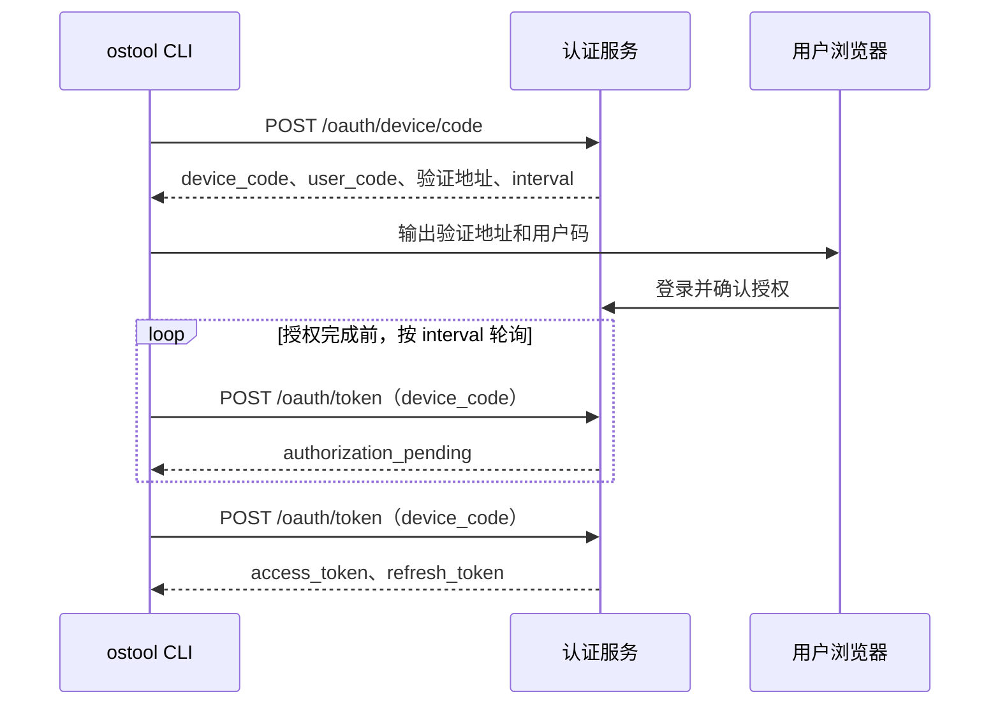

# `ostool` 实际调用的服务 API

本文根据当前 `ostool` 客户端实现整理认证网关和开发板服务的调用接口；不包含 `ostool-server` 管理后台的 `/api/v1/admin/...` 接口。

服务地址来自全局或项目配置中的 `board.server`（完整 URL），可被命令行 `--server` 覆盖；可选的 `board.port` 或 `--port` 用于覆盖 URL 中的端口。为兼容旧的局域网配置，`board.server` 为裸 IPv4 或 IPv6 地址时客户端自动补为 `http://`。基线版本写出的 `board.server_ip` / `board.port` 也会在读取时迁移为 `board.server` / `board.port`，下一次保存配置时只写新格式；无 scheme 的主机名不支持。认证网关和 board API 使用同一个 Base URL。

- `auth_mode = "required"` 时，`board.server` 必须使用 HTTPS，所有请求携带下文描述的 Bearer Token；
- `auth_mode = "disabled"`（默认）时通常使用 HTTP，不会发送认证 Header，适合局域网直连 `ostool-server`。

## 通用认证规则

当 `auth_mode = "required"` 时，所有下列 board HTTP 请求和串口 WebSocket 握手均携带：

```http
Authorization: Bearer <access_token>
```

Access Token 选择规则：

1. `OSTOOL_BOARD_ACCESS_TOKEN` 非空时优先使用；该值不保存也不刷新；
2. 否则读取当前 endpoint 保存的一条本地凭据：PAT 直接使用，OAuth Access Token 剩余有效期超过 60 秒时直接使用；
3. OAuth Access Token 剩余有效期不超过 60 秒时，使用保存的 Refresh Token 刷新后再发送请求。

HTTP 客户端不跟随重定向。认证模式下，绝对 WebSocket URL 必须与 Base URL 使用相同的 scheme、host 和有效端口。

## 命令索引

表中未写全的会话路径均以 `/api/v1/sessions/{session_id}` 为前缀。

| 命令 | 基本功能 | `auth_mode = "required"` 时的行为 | 涉及 API |
| --- | --- | --- | --- |
| `ostool login [--server URL] [--port PORT]` | 发起浏览器 Device Authorization 登录。 | 保存 OAuth 凭据；未指定 `--server` 时使用全局 board 配置。 | `POST /oauth/device/code`；`POST /oauth/token`（Device Code 轮询） |
| `ostool login --with-token [--server URL] [--port PORT]` | 从标准输入导入 PAT。 | 保存 PAT；不刷新该 Token。 | 无网络 API |
| `ostool auth status [--server URL] [--port PORT]` | 显示当前 endpoint 的认证状态。 | 显示凭据类型、已知过期时间和 scope，不显示 Token。 | 无网络 API |
| `ostool logout [--server URL] [--port PORT]` | 退出登录。 | OAuth 凭据会尝试远端撤销；随后删除本地凭据。PAT 仅删除本地副本。 | `POST /oauth/revoke`（仅 OAuth） |
| `ostool board ls [--server URL] [--port PORT]` | 查询按类型聚合的可用开发板信息。 | 调用时携带 Bearer Token。 | `GET /api/v1/board-types` |
| `ostool board connect --board-type TYPE [--server URL] [--port PORT]` | 请求服务端从指定类型中自动分配一块开发板并打开串口终端。 | REST 和 WebSocket 请求均携带 Bearer Token。 | `POST /api/v1/sessions`；`POST /api/v1/sessions/{session_id}/heartbeat`；WebSocket `/api/v1/sessions/{session_id}/serial/ws`；`DELETE /api/v1/sessions/{session_id}` |
| `ostool board run [--server URL] [--port PORT]` | 构建后请求服务端按 `.board.toml` 的 `board_type` 自动分配开发板并启动。 | REST 和 WebSocket 请求均携带 Bearer Token。 | 始终：`POST /api/v1/sessions`、`POST /api/v1/sessions/{session_id}/heartbeat`、`DELETE /api/v1/sessions/{session_id}`。U-Boot：`GET /boot-profile`、`GET /serial`、`GET /tftp`、`GET /dtb`、`GET /dtb/download`、`PUT /files`、WebSocket `/serial/ws`。HTTP Boot：`GET /boot-profile`、`GET /serial`、`PUT /http-boot/kernel`、WebSocket `/serial/ws`。 |

## OAuth Device Authorization API

所有 OAuth 请求使用 `application/x-www-form-urlencoded`。

### 基本原理

该流程是 OAuth 2.0 Device Authorization Grant，适用于 CLI、SSH 和无图形界面环境。它将浏览器中的用户登录与 CLI 获取 Token 分离，使 `ostool` 不接触用户密码，也不需要接收浏览器回调。



第一步只创建短期授权请求：`device_code` 供 CLI 轮询使用，不应展示给用户；`user_code` 用于浏览器授权。用户完成登录和授权前，`/oauth/token` 返回 `authorization_pending`，客户端按服务端给出的轮询间隔继续等待。登录成功后，后续续期仅使用 Refresh Token 调用 `/oauth/token`，不再重新执行设备授权流程。

### 获取设备登录码

```http
POST /oauth/device/code
Content-Type: application/x-www-form-urlencoded

client_id=ostool-cli&scope=board%3Aoperate+offline_access
```

响应至少应包含：

```json
{
  "device_code": "opaque-device-code",
  "user_code": "ABCD-EFGH",
  "verification_uri": "https://board.example.com/activate",
  "verification_uri_complete": "https://board.example.com/activate?user_code=ABCD-EFGH",
  "expires_in": 600,
  "interval": 5
}
```

`verification_uri_complete` 可选；未返回 `interval` 时，客户端默认每 5 秒轮询。

### 使用设备登录码换取 Token

```http
POST /oauth/token
Content-Type: application/x-www-form-urlencoded

grant_type=urn:ietf:params:oauth:grant-type:device_code
&device_code=<device_code>
&client_id=ostool-cli
```

客户端在 `expires_in` 期间按 `interval` 轮询。`authorization_pending` 必须作为非 2xx OAuth 错误响应返回，客户端会继续轮询；`slow_down` 同样必须作为非 2xx OAuth 错误响应返回，客户端会将轮询间隔增加 5 秒。成功的 2xx 响应必须包含下文的完整 Token 字段。

### 刷新 Access Token

```http
POST /oauth/token
Content-Type: application/x-www-form-urlencoded

grant_type=refresh_token
&refresh_token=<refresh_token>
&client_id=ostool-cli
```

当 OAuth Access Token 剩余有效期不超过 60 秒时调用。多个进程共享 Refresh Token 时，客户端会先获得本地跨进程锁，避免并发刷新。

### Token 响应

上述两个 `/oauth/token` 请求均要求返回：

```json
{
  "access_token": "...",
  "refresh_token": "...",
  "token_type": "Bearer",
  "expires_in": 900
}
```

`token_type` 必须为 `Bearer`，`expires_in` 必须为正数，`refresh_token` 必须非空。`scope` 为可选字段。
服务端应在刷新时返回轮换后的 Refresh Token。

### 撤销 OAuth 会话

```http
POST /oauth/revoke
Content-Type: application/x-www-form-urlencoded

token=<refresh_token>
&token_type_hint=refresh_token
&client_id=ostool-cli
```

执行 `ostool logout` 时调用。客户端将 HTTP 2xx 和 404 都视为成功；其他错误只会输出警告，随后仍删除本地凭据。

### OAuth 错误响应

认证客户端尝试解析：

```json
{
  "error": "invalid_grant",
  "error_description": "optional detail"
}
```

刷新时若错误包含 `invalid_grant` 或 `invalid_token`，客户端删除本地 OAuth 凭据并要求重新登录。

## Board REST API

本节覆盖 `ostool-server` 的全部公开、非管理 REST 接口。`ostool` 当前命令直接调用其中的大部分接口；电源控制、HTTP Boot 普通文件上传及会话查询/文件管理端点虽未由当前命令路径调用，仍是 `BoardServerClient` 或公开 board 服务契约的一部分。

### 查询开发板类型

```http
GET /api/v1/board-types
```

用于 `ostool board ls`。客户端只接受 `ostool-server` 的已聚合开发板类型列表：

```json
[
  {
    "board_type": "rk3568",
    "tags": [],
    "total": 2,
    "available": 1
  }
]
```

每个 `board_type` 仅有一个聚合条目：`total` 是该类型未禁用开发板的数量，`available` 是其中租约状态为 idle 的数量，`tags` 是该类型所有未禁用开发板标签的去重并集。该接口不返回 `board_id`；创建会话时由服务端自动选择实际开发板，并在成功响应中返回 `board_id`。

### 创建会话

```http
POST /api/v1/sessions
Content-Type: application/json

{
  "board_type": "rk3568",
  "required_tags": [],
  "client_name": "ostool"
}
```

用于 `ostool board connect` 和 `ostool board run`。`board_type` 必填，`required_tags` 由当前 CLI 固定发送空数组，`client_name` 固定为 `ostool`。服务端在满足类型和标签条件的空闲开发板中自动分配，不支持通过当前 `ostool` 指定 `board_id`。

成功时返回 `201 Created`：

```json
{
  "session_id": "...",
  "board_id": "rk3568-01",
  "lease_expires_at": "2026-07-20T02:00:00Z",
  "serial_available": true,
  "boot_mode": "uboot",
  "ws_url": "/api/v1/sessions/.../serial/ws"
}
```

指定类型不存在时返回 `404`；类型存在但没有符合条件的空闲开发板时返回 `409`。客户端会对后一种情况每秒重试一次，直到分配成功或收到其他错误。

### 查询会话详情

```http
GET /api/v1/sessions/{session_id}
```

请求没有请求体，成功返回 `200 OK`：

```json
{
  "session": {
    "id": "...",
    "board_id": "rk3568-01",
    "client_name": "ostool",
    "created_at": "2026-07-20T02:00:00Z",
    "last_heartbeat_at": "2026-07-20T02:00:01Z",
    "expires_at": "2026-07-20T02:01:01Z",
    "serial_connected": false,
    "state": "active"
  },
  "board": {
    "id": "rk3568-01",
    "board_type": "rk3568",
    "tags": ["lab"],
    "serial": null,
    "power_management": {
      "kind": "custom",
      "power_on_cmd": "power-on",
      "power_off_cmd": "power-off"
    },
    "boot": {
      "kind": "uboot",
      "use_tftp": true,
      "dtb_name": null,
      "kernel_load_addr": null,
      "fit_load_addr": null,
      "bootm_addr": null,
      "network_mode": "dhcp",
      "board_ip": null,
      "server_ip": null,
      "netmask": null,
      "gatewayip": null
    },
    "notes": null,
    "disabled": false
  },
  "serial_available": false,
  "serial_connected": false,
  "files": []
}
```

`session.state` 为会话生命周期状态；`board.serial`、`board.notes` 可为 `null`。`files` 的元素使用下方“上传会话文件”中的文件响应格式。

### 会话保活与释放

```http
POST /api/v1/sessions/{session_id}/heartbeat
DELETE /api/v1/sessions/{session_id}
```

两个请求均没有请求体。心跳成功返回 `200 OK`：

```json
{
  "session_id": "...",
  "lease_expires_at": "2026-07-20T02:00:00Z"
}
```

删除成功时服务端返回 `202 Accepted` 且没有响应体；删除时返回 `404`，客户端也将其视为已释放。

### 获取启动配置

```http
GET /api/v1/sessions/{session_id}/boot-profile
```

请求没有请求体，成功返回 `200 OK`。`boot.kind` 决定 `boot` 对象的具体字段：

```json
{
  "boot": {
    "kind": "uboot",
    "use_tftp": true,
    "dtb_name": "board.dtb",
    "kernel_load_addr": "0x80200000",
    "fit_load_addr": "0x82200000",
    "bootm_addr": "0x82200000",
    "network_mode": "dhcp",
    "board_ip": null,
    "server_ip": null,
    "netmask": null,
    "gatewayip": null
  },
  "server_ip": "192.168.1.2",
  "netmask": "255.255.255.0",
  "interface": "eth0",
  "http_base_url": "http://192.168.1.2:2999/"
}
```

`boot.kind` 可为 `uboot`、`pxe` 或 `httpboot`（客户端也接受别名 `uefi_http`）。`pxe` 的对象仅含可选 `notes`；`httpboot` 的对象含可选 `boot_arch`（`x86_64`、`aarch64`、`loongarch64`、`riscv64` 或 `other`）和 `mac`。顶层 `server_ip`、`netmask`、`interface`、`http_base_url` 均可为 `null`。`server_ip` 和 `http_base_url` 使用板端可访问的网络地址，不一定等于管理网地址。

### 获取串口状态

```http
GET /api/v1/sessions/{session_id}/serial
```

请求没有请求体，成功返回 `200 OK`：

```json
{
  "available": true,
  "connected": false,
  "port": "/dev/ttyUSB0",
  "baud_rate": 115200,
  "ws_url": "/api/v1/sessions/.../serial/ws"
}
```

没有串口时，`available` 和 `connected` 为 `false`，`port`、`baud_rate`、`ws_url` 均为 `null`。

### 获取 TFTP 状态

```http
GET /api/v1/sessions/{session_id}/tftp
```

请求没有请求体，成功返回 `200 OK`：

```json
{
  "available": true,
  "provider": "internal",
  "server_ip": "192.168.1.2",
  "netmask": "255.255.255.0",
  "writable": true,
  "files": [
    {
      "filename": "Image",
      "relative_path": "boot/Image",
      "tftp_url": "tftp://192.168.1.2/boot/Image",
      "size": 1048576,
      "uploaded_at": "2026-07-20T02:00:00Z"
    }
  ]
}
```

`server_ip`、`netmask` 和每个文件的 `tftp_url` 可为 `null`。`available` 表示 TFTP 已启用、健康、可写且能解析服务端 IP。

### 获取和下载预置 DTB

```http
GET /api/v1/sessions/{session_id}/dtb
GET /api/v1/sessions/{session_id}/dtb/download
```

第一个请求没有请求体，成功返回 `200 OK` 的 DTB 元数据：

```json
{
  "dtb_name": "board.dtb",
  "relative_path": "boot/dtb/board.dtb",
  "session_file_path": "boot/dtb/board.dtb",
  "tftp_url": "tftp://192.168.1.2/boot/dtb/board.dtb"
}
```

没有预置 DTB 时上述四个字段均为 `null`。下载接口没有请求体，成功返回 `200 OK`、`Content-Type: application/octet-stream` 和 DTB 原始字节；未配置预置 DTB 或文件不存在时返回 `404`。

### 开关机

```http
POST /api/v1/sessions/{session_id}/board/power-on
POST /api/v1/sessions/{session_id}/board/power-off
```

这两个 `BoardServerClient` 方法没有请求体，成功返回 `200 OK`：

```json
{
  "ok": true,
  "message": "..."
}
```

`message` 由具体电源管理实现返回。

### 上传会话文件

```http
PUT /api/v1/sessions/{session_id}/files
X-File-Path: <relative_path>

<raw file bytes>
```

`X-File-Path` 必填，必须是相对路径；请求体是文件原始字节。成功返回 `201 Created`：

```json
{
  "filename": "Image",
  "relative_path": "boot/Image",
  "tftp_url": "tftp://192.168.1.2/boot/Image",
  "http_url": "http://192.168.1.2:2999/share/sessions/.../boot/Image",
  "size": 1048576,
  "uploaded_at": "2026-07-20T02:00:00Z"
}
```

`tftp_url` 可为 `null`；`http_url` 使用板端可访问的服务地址。会话文件 HTTP
共享不依赖 TFTP 是否启用。

### 列出、查询和删除会话文件

```http
GET /api/v1/sessions/{session_id}/files
GET /api/v1/sessions/{session_id}/files/{path}
DELETE /api/v1/sessions/{session_id}/files/{path}
```

三个请求均没有请求体。前两个请求成功返回 `200 OK`：列表接口返回文件对象数组，单文件接口返回一个文件对象，格式与上传会话文件的成功响应相同。删除成功返回 `204 No Content`。`path` 必须是相对路径。

历史上传路径 `PUT /api/v1/sessions/{session_id}/files/{path}` 被明确拒绝并返回 `404`；上传必须使用前述 `PUT /files` 加 `X-File-Path` Header 的形式。

### 下载共享会话文件

```http
GET /share/sessions/{session_id}/{relative_path}
Range: bytes=<start>-<end>  # 可选
```

该端点适用于所有 boot mode，与 TFTP 和 HTTP Boot 开关无关。无 Range 时返回
`200 OK` 和完整文件；合法单段 Range 返回 `206 Partial Content`。URL 仅在 session
活动期间有效，session 释放、超时或进入 releasing 状态后返回 `404`，对应文件随
session 清理。

### 上传 HTTP Boot 文件

```http
PUT /api/v1/sessions/{session_id}/http-boot/files
X-File-Path: <relative_path>

<raw file bytes>
```

`X-File-Path` 必填，请求体是文件原始字节。成功返回 `201 Created`：

```json
{
  "filename": "kernel.elf",
  "relative_path": "kernel.elf",
  "http_url": "https://board.example.com/boot/sessions/.../kernel.elf",
  "size": 1048576,
  "uploaded_at": "2026-07-20T02:00:00Z"
}
```

### 下载 HTTP Boot 文件

```http
GET /boot/sessions/{session_id}/{path}
Range: bytes=<start>-<end>  # 可选
```

该接口供目标机 HTTP Boot 下载已上传文件，请求没有消息体。无 Range 时成功返回 `200 OK` 和文件原始字节；带合法单段 Range 时返回 `206 Partial Content`，并包含 `Content-Range`、`Content-Length`、`Accept-Ranges: bytes`。响应的 `Content-Type` 根据文件名推断。`path` 必须是相对路径。

### 上传 HTTP Boot 内核

```http
PUT /api/v1/sessions/{session_id}/http-boot/kernel
X-HttpBoot-Remote-Name: <remote_name>        # 可选，默认 kernel.elf
X-HttpBoot-Arch: <arch>                       # 必填：x86_64、aarch64、loongarch64、riscv64 或 other
X-HttpBoot-Image-Format: <image_format>       # 可选，当前仅支持 elf64
X-HttpBoot-Entry-Symbol: <entry_symbol>  # 可选

<raw kernel bytes>
```

请求体是内核原始字节。成功返回 `201 Created`：

```json
{
  "boot_id": "...",
  "kernel_url": "https://board.example.com/boot/sessions/.../kernel.elf",
  "kernel_size": 1048576,
  "kernel_sha256": "..."
}
```

`kernel_sha256` 可为 `null`。当前 `ostool board run` 的 HTTP Boot 流程固定发送 `remote_name=kernel.elf`、`image_format=elf64` 和 `entry_symbol=httpboot_entry`。

## 串口 WebSocket API

会话创建或串口状态响应中的 `ws_url` 用于建立串口连接。相对地址相对于 Base URL 解析；HTTP/HTTPS Base URL 会分别转换为 `ws`/`wss`。

```http
GET /api/v1/sessions/{session_id}/serial/ws
Upgrade: websocket
Authorization: Bearer <access_token>  # 仅 required 模式
```

WebSocket 二进制帧承载串口字节流；客户端关闭时会发送：

```json
{"type":"close"}
```

## Board API 错误响应

非成功的 board REST 响应优先按以下格式解析：

```json
{
  "code": "not_found",
  "message": "board type `rk3568` not found",
  "details": null
}
```

`details` 是可选 JSON 值，当前服务端通常返回 `null`；客户端只使用 `code` 和 `message`。任一 board API 返回 `401 Unauthorized` 时，客户端删除当前 endpoint 的本地凭据；不会自动刷新并重试该业务请求。
