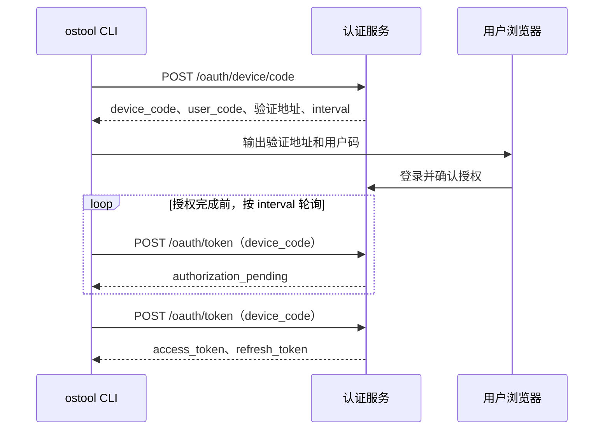

# `ostool` 实际调用的服务 API

本文根据当前 `ostool` 实现整理认证网关和开发板服务的调用接口。

服务地址来自全局或项目配置中的 `board.server`（完整 URL），可被命令行 `--server` 覆盖；可选的 `board.port` 或 `--port` 用于覆盖 URL 中的端口。认证网关和 board API 使用同一个 Base URL。

- `auth_mode = "required"` 时，`board.server` 必须使用 HTTPS，所有请求携带下文描述的 Bearer Token；
- `auth_mode = "disabled"`（默认）时通常使用 HTTP，不会发送认证 Header，适合局域网直连 `ostool-server`。

## 通用认证规则

当 `auth_mode = "required"` 时，所有下列 board HTTP 请求和串口 WebSocket 握手均携带：

```http
Authorization: Bearer <access_token>
```

Access Token 来源优先级：

1. `OSTOOL_BOARD_ACCESS_TOKEN` 环境变量；
2. 本地保存的 PAT；
3. 本地保存的 OAuth Access Token；若剩余有效期不超过 60 秒，则先刷新。

HTTP 客户端不跟随重定向。认证模式下，绝对 WebSocket URL 必须与 Base URL 使用相同的 scheme、host 和有效端口。

## 命令索引

表中未写全的会话路径均以 `/api/v1/sessions/{session_id}` 为前缀。

| 命令 | 基本功能 | `auth_mode = "required"` 时的行为 | 涉及 API |
| --- | --- | --- | --- |
| `ostool login [--server URL] [--port PORT]` | 发起浏览器 Device Authorization 登录。 | 保存 OAuth 凭据；未指定 `--server` 时使用全局 board 配置。 | `POST /oauth/device/code`；`POST /oauth/token`（Device Code 轮询） |
| `ostool login --with-token [--server URL] [--port PORT]` | 从标准输入导入 PAT。 | 保存 PAT；不刷新该 Token。 | 无网络 API |
| `ostool auth status [--server URL] [--port PORT]` | 显示当前 endpoint 的认证状态。 | 显示凭据类型、已知过期时间和 scope，不显示 Token。 | 无网络 API |
| `ostool logout [--server URL] [--port PORT]` | 退出登录。 | OAuth 凭据会尝试远端撤销；随后删除本地凭据。PAT 仅删除本地副本。 | `POST /oauth/revoke`（仅 OAuth） |
| `ostool board ls [--server URL] [--port PORT]` | 查询可用开发板类型。 | 调用时携带 Bearer Token。 | `GET /api/v1/board-types` |
| `ostool board connect --board-type TYPE [--server URL] [--port PORT]` | 分配开发板并打开串口终端。 | REST 和 WebSocket 请求均携带 Bearer Token。 | `POST /api/v1/sessions`；`POST /api/v1/sessions/{session_id}/heartbeat`；`GET /api/v1/sessions/{session_id}/serial/ws`；`DELETE /api/v1/sessions/{session_id}` |
| `ostool board run [--server URL] [--port PORT]` | 构建、分配开发板、上传产物并启动。 | REST 和 WebSocket 请求均携带 Bearer Token。 | 始终：`POST /api/v1/sessions`、`POST /api/v1/sessions/{session_id}/heartbeat`、`DELETE /api/v1/sessions/{session_id}`。U-Boot：`GET /boot-profile`、`GET /serial`、`GET /tftp`、`GET /dtb`、`GET /dtb/download`、`PUT /files`、`GET /serial/ws`。HTTP Boot：`GET /boot-profile`、`GET /serial`、`PUT /http-boot/kernel`、`GET /serial/ws`。 |

## OAuth Device Authorization API

所有 OAuth 请求使用 `application/x-www-form-urlencoded`。

### 基本原理

该流程是 OAuth 2.0 Device Authorization Grant，适用于 CLI、SSH 和无图形界面环境。它将浏览器中的用户登录与 CLI 获取 Token 分离，使 `ostool` 不接触用户密码，也不需要接收浏览器回调。



第一步只创建短期授权请求：`device_code` 供 CLI 轮询使用，不应展示给用户；`user_code` 用于浏览器授权。用户完成登录和授权前，`/oauth/token` 返回 `authorization_pending`，客户端按服务端给出的轮询间隔继续等待。登录成功后，后续续期仅使用 Refresh Token 调用 `/oauth/token`，不再重新执行设备授权流程。

### 获取设备登录码

```http
POST /oauth/device/code
Content-Type: application/x-www-form-urlencoded

client_id=ostool-cli&scope=board%3Aoperate+offline_access
```

响应至少应包含：

```json
{
  "device_code": "opaque-device-code",
  "user_code": "ABCD-EFGH",
  "verification_uri": "https://board.example.com/activate",
  "verification_uri_complete": "https://board.example.com/activate?user_code=ABCD-EFGH",
  "expires_in": 600,
  "interval": 5
}
```

`verification_uri_complete` 可选；未返回 `interval` 时，客户端默认每 5 秒轮询。

### 使用设备登录码换取 Token

```http
POST /oauth/token
Content-Type: application/x-www-form-urlencoded

grant_type=urn:ietf:params:oauth:grant-type:device_code
&device_code=<device_code>
&client_id=ostool-cli
```

客户端在 `expires_in` 期间按 `interval` 轮询。响应中的 `authorization_pending` 会继续轮询；`slow_down` 会使轮询间隔增加 5 秒。

### 刷新 Access Token

```http
POST /oauth/token
Content-Type: application/x-www-form-urlencoded

grant_type=refresh_token
&refresh_token=<refresh_token>
&client_id=ostool-cli
```

当 OAuth Access Token 剩余有效期不超过 60 秒时调用。多个进程共享 Refresh Token 时，客户端会先获得本地跨进程锁，避免并发刷新。

### Token 响应

上述两个 `/oauth/token` 请求均要求返回：

```json
{
  "access_token": "...",
  "refresh_token": "...",
  "token_type": "Bearer",
  "expires_in": 900,
  "scope": "board:operate offline_access"
}
```

`token_type` 必须为 `Bearer`，`expires_in` 必须为正数，`refresh_token` 必须非空。
服务端应在刷新时返回轮换后的 Refresh Token。

### 撤销 OAuth 会话

```http
POST /oauth/revoke
Content-Type: application/x-www-form-urlencoded

token=<refresh_token>
&token_type_hint=refresh_token
&client_id=ostool-cli
```

执行 `ostool logout` 时调用。客户端将 HTTP 2xx 和 404 都视为成功；其他错误只会输出警告，随后仍删除本地凭据。

### OAuth 错误响应

认证客户端尝试解析：

```json
{
  "error": "invalid_grant",
  "error_description": "optional detail"
}
```

刷新时若错误包含 `invalid_grant` 或 `invalid_token`，客户端删除本地 OAuth 凭据并要求重新登录。

## Board REST API

### 查询开发板类型

```http
GET /api/v1/board-types
```

用于 `ostool board ls`。客户端接受两种响应格式：

`ostool-server` 直接返回已聚合的开发板类型列表：

```json
[
  {
    "board_type": "rk3568",
    "tags": [],
    "total": 2,
    "available": 1
  }
]
```

认证网关则返回逐块列出开发板的 envelope：

```json
{
  "data": [
    { "model": "rk3568", "status": "available" },
    { "model": "rk3568", "status": "in_use" }
  ]
}
```

客户端按 `model` 聚合：每个唯一 `model` 对应一个条目，`total` 等于该型号出现的次数，`available` 等于 `status` 不区分大小写为 `available` 的数量，`tags` 始终为空数组。

### 创建会话

```http
POST /api/v1/sessions
Content-Type: application/json

{
  "board_type": "rk3568",
  "required_tags": [],
  "client_name": "ostool"
}
```

用于 `ostool board connect` 和 `ostool board run`。

### 会话保活与释放

```http
POST /api/v1/sessions/{session_id}/heartbeat
DELETE /api/v1/sessions/{session_id}
```

心跳请求没有请求体。删除会话返回 404 时，客户端将其视为已释放。

### 查询会话启动与串口信息

```http
GET /api/v1/sessions/{session_id}/boot-profile
GET /api/v1/sessions/{session_id}/serial
GET /api/v1/sessions/{session_id}/tftp
GET /api/v1/sessions/{session_id}/dtb
GET /api/v1/sessions/{session_id}/dtb/download
```

分别获取启动配置、串口状态、TFTP 状态、DTB 元数据和 DTB 原始内容。

### 开关机

```http
POST /api/v1/sessions/{session_id}/board/power-on
POST /api/v1/sessions/{session_id}/board/power-off
```

请求没有请求体。

### 上传会话文件

```http
PUT /api/v1/sessions/{session_id}/files
X-File-Path: <relative_path>

<raw file bytes>
```

### 上传 HTTP Boot 文件

```http
PUT /api/v1/sessions/{session_id}/http-boot/files
X-File-Path: <relative_path>

<raw file bytes>
```

### 上传 HTTP Boot 内核

```http
PUT /api/v1/sessions/{session_id}/http-boot/kernel
X-HttpBoot-Remote-Name: <remote_name>
X-HttpBoot-Arch: <arch>
X-HttpBoot-Image-Format: <image_format>
X-HttpBoot-Entry-Symbol: <entry_symbol>  # 可选

<raw kernel bytes>
```

## 串口 WebSocket API

会话创建或串口状态响应中的 `ws_url` 用于建立串口连接。相对地址相对于 Base URL 解析；HTTP/HTTPS Base URL 会分别转换为 `ws`/`wss`。

```http
GET /api/v1/sessions/{session_id}/serial/ws
Upgrade: websocket
Authorization: Bearer <access_token>  # 仅 required 模式
```

WebSocket 二进制帧承载串口字节流；客户端关闭时会发送：

```json
{"type":"close"}
```

## Board API 错误响应

非成功的 board REST 响应优先按以下格式解析：

```json
{
  "code": "not_found",
  "message": "board type `rk3568` not found"
}
```

任一 board API 返回 `401 Unauthorized` 时，客户端删除当前 endpoint 的本地凭据；不会自动刷新并重试该业务请求。
