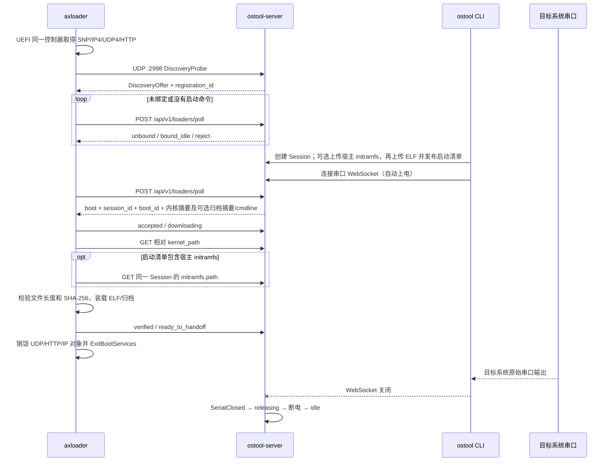

# axloader 网络控制与虚拟板

本文说明 `httpboot-protocol` v3、`axloader`、`ostool-server`、`ostool` CLI 和管理页面之间的网络启动契约。服务端仍接受不使用宿主 initramfs/cmdline 的 v2 loader；该契约不兼容旧版串口 `READY/BOOT` 协议。

## 设计边界

- 控制面只使用 UDP 发现和 HTTP。串口只承载目标系统的原始输入输出。
- `BoardConfig.network_identity.mac_address` 是板卡和配置之间唯一持久绑定；探测记录只驻留内存。
- `board_type`、板卡 ID、电源、串口和启动配置始终由管理员填写。SMBIOS 仅辅助辨认硬件，不推断 `board_type`。
- MAC 是绑定键，不是认证凭据。当前协议用于受信实验室二层网络；HTTP 和镜像 SHA-256 不抵抗同网段主动攻击。
- 服务重启后会重新读取板卡 TOML，但不恢复旧 Session、启动清单、loader 状态或客户端连接。

## 启动流程



`ready_to_handoff` 是最后一个可靠网络状态。它不会消费启动清单；同一 Session 内板卡重启后，新 `registration_id` 会重新取得相同 `boot_id`。上传新内核才会以新 `boot_id` 替换旧命令。Session 释放时，启动命令和 loader 状态一起删除。

宿主归档由 CLI 先以会话内路径 `initramfs.cpio` 上传，再在发布内核时以
`X-HttpBoot-Initramfs-Path` 引用；`X-HttpBoot-Cmdline` 可独立提供命令行。
服务端读取同一 Session 的归档并记录大小、SHA-256，拒绝空文件或超过
256 MiB 的归档；命令行最长 4095 字节，仅允许可打印 ASCII 和空格。
v3 loader 从启动清单取得可选的 `initramfs: {path, size, sha256}` 和
`cmdline`，从当前 Session 下载并再次核对归档，失败时不上交内核。
v2 loader 遇到任一新字段时收到 `boot_payload_unsupported`，没有新字段的
启动保持兼容。摘要用于发现不一致，不替代受信网络或认证。

## 发现和注册代次

axloader 向当前 IPv4 子网定向广播地址的 UDP `2998` 发送 JSON。数据报不得超过 1400 字节，只含协议版本、永久 MAC、当前链路 MAC、架构和 loader 版本。SMBIOS Type 1 详情在 HTTP poll 中上报。

server 为每次发现签发一次性 `registration_id`，默认有效期为 30 秒。第一次 poll 后它代表当前 loader 启动代次：

- 新代次可以替换不再上报的旧代次；
- 被替换的旧代次若再次上报，则该 MAC 进入冲突状态；
- 冲突期间 server 返回 `duplicate_mac`，不下发启动命令；
- 10 秒没有 poll 的设备显示为离线，探测记录保留 24 小时；
- 每次 poll 都从当前板卡 TOML 重新计算 `bound_board_id`，不保存第二份绑定关系。

axloader 如果发现两个不同的 `server_id`，不会随机选择其中一个，而是按 1、2、4、8、10 秒封顶退避重新发现。

## HTTP 接口

| 方法与路径 | 调用者 | 含义 |
| --- | --- | --- |
| `POST /api/v1/loaders/poll` | axloader | 注册或刷新设备，返回 `unbound`、`bound_idle`、`boot` 或 `reject` |
| `POST /api/v1/loaders/status` | axloader | 上报 `accepted`、`downloading`、`verified`、`ready_to_handoff` 或 `failed` |
| `GET /api/v1/admin/loader-devices` | 管理页面 | 查询探测设备、绑定、在线和冲突状态 |
| `GET /api/v1/sessions/{id}/loader-status` | CLI/管理工具 | 查询当前 Session 的 `boot_id`、`registration_id` 和状态 |
| `GET /api/v1/admin/virtual-devices` | 管理页面 | 查询虚拟板功能开关和进程状态 |
| `POST /api/v1/admin/virtual-devices` | 管理页面 | 创建并启动一个尚未绑定的 QEMU 设备 |
| `DELETE /api/v1/admin/virtual-devices/{id}` | 管理页面 | 停止并删除未绑定虚拟设备 |

`boot` 响应中的内核路径必须是当前 server 下的相对路径，同时包含大小、SHA-256、架构、`elf64` 格式和可选入口符号；v3 还可包含宿主归档的相对路径、大小、SHA-256 及命令行。状态更新由 `session_id + boot_id + registration_id` 定位；旧启动命令或旧注册代次的迟到状态返回冲突，不能覆盖当前状态。

## 板卡配置

HTTP Boot 实体板示例：

```toml
id = "rk3568-01"
board_type = "RK3568"
disabled = false
tags = ["arm64"]

[network_identity]
mac_address = "02:11:22:33:44:55"

[serial]
baud_rate = 1500000

[serial.key]
kind = "serial_number"
value = "USB-UART-01"

[power_management]
kind = "custom"
power_on_cmd = "board-power rk3568-01 on"
power_off_cmd = "board-power rk3568-01 off"

[boot]
kind = "httpboot"
boot_arch = "aarch64"
```

MAC 保存为小写六字节冒号格式并全局唯一。HTTP Boot 板卡缺少 MAC 时配置无效。只有板卡处于 `idle` 时才允许修改 MAC、重命名或删除；使用中和释放中返回 `409 Conflict`。重复绑定返回错误码 `mac_already_bound`。

管理页面通过 `/api/v1/admin/events` 接收设备快照与增量事件，取消定时刷新。创建页可以在未保存板卡、未填写 MAC 时直接按当前电源配置手动上电或下电；设备上报后实时出现在 MAC 选择列表。选择探测设备只会把 MAC 带入编辑器并展示 IP、架构、loader 版本和 SMBIOS；不会自动填写板卡 ID、`board_type`、电源、串口或启动设置。也可以手工输入 MAC。

## ostool CLI 行为

HTTP Boot runner 按以下顺序工作：

1. 按人工配置的 `board_type` 创建 Session；
2. 可选地上传宿主归档到该 Session；上传 ELF 时引用归档路径并发布新的 `boot_id`；
3. 立即连接串口 WebSocket，由现有串口生命周期自动上电；
4. 并行读取原始串口并轮询 loader status；
5. 活动 Session 内板卡重启时继续等待新注册代次，不重建 Session；
6. loader 报告 `failed` 时结束；正常成功仍以目标系统串口成功条件为准；
7. WebSocket 关闭后沿用 `SerialClosed` 释放流程并断电。

`.board.toml` 中的 `initramfs` 和 `cmdline` 都是可选字段。前者是宿主归档，
不是虚拟机内 Linux guest 的 initrd；后者传给宿主内核。只有目标 loader、
固件与内核实现了对应交接时才配置这些字段。

## 内建 QEMU 虚拟板

虚拟板默认关闭。第一阶段固定为 `x86_64 + OVMF + q35`，使用 TCG，协议类型仍保留其他架构值。示例 server 配置：

```toml
[loader_network]
enabled = true
bind_addr = "0.0.0.0:2998"
public_base_url = "http://10.77.0.1:2999"

[virtual_qemu]
enabled = true
qemu_binary = "/usr/bin/qemu-system-x86_64"
ovmf_code = "/usr/share/OVMF/OVMF_CODE_4M.fd"
ovmf_vars = "/usr/share/OVMF/OVMF_VARS_4M.fd"
axloader_efi = "/opt/ostool/BOOTX64.EFI"
runtime_dir = "/var/lib/ostool-server/qemu"
network_namespace = "ostool-qemu"
bridge = "ostool-br0"
tap_pool = ["ostool-tap0", "ostool-tap1"]
memory_mib = 512
cpus = 2
```

本地网络环境命令需要创建 network namespace、veth、bridge、TAP 和 dnsmasq，因此应以具备 `CAP_NET_ADMIN` 的身份运行：

```bash
ostool-server --config /etc/ostool-server/config.toml virtual-lab up
ostool-server --config /etc/ostool-server/config.toml virtual-lab status
ostool-server --config /etc/ostool-server/config.toml virtual-lab down
```

默认客户机网段为 `10.77.0.0/24`，server 为 `10.77.0.1`，dnsmasq/bridge 为 `10.77.0.254`，DHCP 池为 `10.77.0.100-200`。`up`、`status` 和 `down` 可以重复调用；`up` 检测已存在环境，`down` 忽略已删除资源。

管理页面启动虚拟设备后，QEMU 必须通过真实 UDP/HTTP 流程出现在未绑定列表。绑定时三个位置必须引用同一虚拟设备及其 MAC：

```toml
[network_identity]
mac_address = "02:aa:bb:cc:dd:ee"

[serial]
baud_rate = 115200

[serial.key]
kind = "qemu"
value = "<virtual_device_id>"

[power_management]
kind = "qemu"
virtual_device_id = "<virtual_device_id>"

[boot]
kind = "httpboot"
boot_arch = "x86_64"
```

`VirtualBoardManager` 持有 QEMU 子进程、TAP、独立 OVMF VARS、QMP socket 和串口 hub。`On`/`Off` 幂等；关闭先发 QMP `quit`，3 秒后仍未退出才终止进程。串口 hub 不随 QEMU 子进程退出，保留最近 64 KiB 输出，使同一 WebSocket 能跨 `Off → On`。新 QEMU 启动会生成新的 loader 注册代次，并从同一活动 Session 重新取得原 `boot_id`。

## 验收顺序

1. 启动未绑定 QEMU，确认它通过真实发现出现在管理页面。
2. 人工填写板卡 ID、名称/类型、QEMU 电源和串口，并选择探测 MAC。
3. 使用 `ostool` 创建 Session、上传 ELF并连接串口，确认下载、摘要校验、handoff 和串口成功标志。
4. 保持 WebSocket 和 Session，执行虚拟板 `Off → On`，确认新 `registration_id` 取得相同 `boot_id` 并再次 handoff。
5. 关闭 WebSocket，确认 Session 经 `releasing` 回到 `idle` 且 QEMU 退出。
6. 新建 Session 再运行一次，全程不修改绑定。

实体板按相同顺序验收首次绑定、活动 Session 内重启、释放和新 Session；差异只在电源与串口后端。
