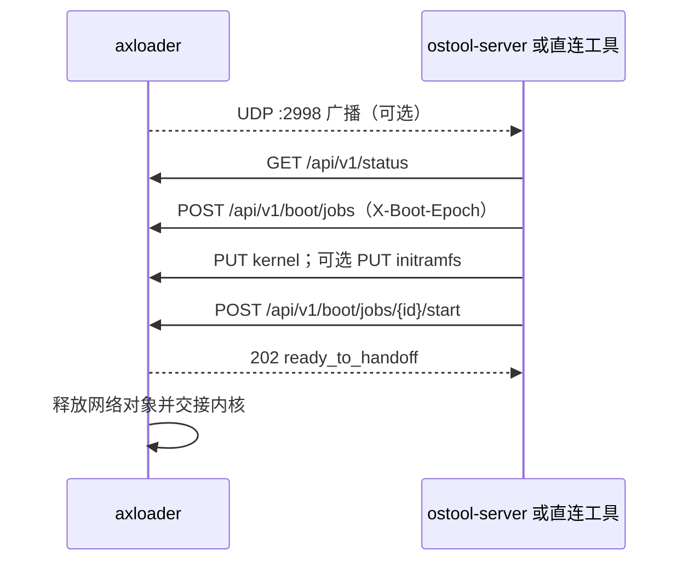

# axloader 网络控制与本地验证

## 1. 设备所有权

### 1.1 入口与发现

协议 v5 将 HTTP 控制入口放在 axloader。`network::Announcer` 在同一 UEFI 网卡
向 UDP `2998` 单向广播 MAC、架构、启动代次和设备 TCP4 端口 `2999`；
`direct::Listener` 在该端口处理启动与 OTA。ostool-server 的
`loader::serve_udp_discovery()` 对 v5 广播调用 `device::reconcile()`，先反向
GET 设备状态，核对 MAC、代次和架构，才从板卡 TOML 中查找当前绑定。
发现不要求服务端响应：直连客户端知道设备 IP 时可独立控制装载器。
设备没有可写 ESP 或 OTA 状态区时，状态响应中的 `ota` 可以为空；服务端记录
告警并跳过升级决策，已有 Session 的普通启动推送仍然可用。

广播和 HTTP 没有身份认证。MAC 仅作板卡配置绑定键；报文和镜像的 SHA-256
仅检验一致性，本阶段限定可信隔离实验网。服务器对重复 MAC 且不同来源 IP
的在线设备停止下发任务，新的启动代次替代同地址的旧实例；设备拒绝旧代次的
修改请求。

### 1.2 启动交接

`BootServer` 在内存维护一个 `DeviceBootJob`。内核和可选 initramfs 由调用方
PUT 上传，各自按清单长度及 SHA-256 检验，每个文件不超过 256 MiB。cmdline
和 initramfs 相互独立且都可省略。`POST /api/v1/boot/jobs/{id}/start` 只接受
x86_64 ELF64 的 `__x86_64_efi_pe_entry`，把 cmdline 安装为 EFI LoadOptions，
并仅在归档存在时发布 TGOS `BootPayload` 配置表；回复 `ready_to_handoff` 后释放
TCP4 与 UDP4 对象，进入 UEFI 内核交接。
没有 ESP 写入或 ostool-server 时，同样可以从设备 IP 直连完成启动。


```mermaid
sequenceDiagram
    participant L as axloader
    participant S as ostool-server 或直连工具
    L-->>S: UDP :2998 广播（可选）
    S->>L: GET /api/v1/status
    S->>L: POST /api/v1/boot/jobs（X-Boot-Epoch）
    S->>L: PUT kernel；可选 PUT initramfs
    S->>L: POST /api/v1/boot/jobs/{id}/start
    L-->>S: 202 ready_to_handoff
    L->>L: 释放网络对象并交接内核
```

ostool-server 保留原有 Session、串口 WebSocket、启动清单和板卡租约。会话
上传文件后，`device::push_boot()` 从会话存储读取并重新核对长度与摘要，
再调用设备接口；它不把文件 URL 交给装载器。设备在同一 Session 内复位时，
服务器观察新启动代次并按原 `boot_id` 重新推送。串口只承载目标系统输出。
若同一启动代次仍保留其他 `boot_id`，服务器在创建返回 `409` 后按状态中的旧 ID
删除该事务，再尝试创建一次；第二次仍冲突则停止本次推送，等待后续设备广播。

## 2. 设备协议

### 2.1 启动事务

所有修改调用携带当前 `/api/v1/status` 返回的 `X-Boot-Epoch`。
`BootServer::create()` 只接受 x86_64 ELF64、非空合法启动 ID、预期长度与
摘要、固定 EFI 入口，以及合法的可选命令行；相同 ID 和清单的重试保留已接收文件，
冲突清单返回 `409`。设备只保留一个启动事务，可在启动前取消。

| 方法与路径 | 结果 |
| --- | --- |
| `GET /api/v1/status` | 返回 v5、MAC、启动代次、硬件、启动事务及 OTA 状态 |
| `POST /api/v1/boot/jobs` | 提交 `DeviceBootJob`；创建返回 `201`，幂等重试返回 `200` |
| `GET /api/v1/boot/jobs/{id}` | 查询事务阶段及已接收文件 |
| `PUT /api/v1/boot/jobs/{id}/kernel` | 原始内核，必须带定长和 `X-Image-Sha256` |
| `PUT /api/v1/boot/jobs/{id}/initramfs` | 原始可选归档，采用相同校验规则 |
| `POST /api/v1/boot/jobs/{id}/start` | 文件齐备且装载成功返回 `202` 并交接 |
| `DELETE /api/v1/boot/jobs/{id}` | 未交接时释放事务和文件 |

请求头限制 4 KiB；仅接受 `Content-Length`，连接空闲 30 秒后取消，短读和
错误摘要或上传中断释放启动事务。长时间接收过程中等待路径继续驱动 UDP 广播；单个设备
一次只处理一个 TCP 连接。需要同时上传或查询的客户端应等当前请求完成。

### 2.2 装载器升级

设备复用 `ota::OtaContext` 和现有 A/B 启动器：流式写入非活动槽，完成文件
摘要、PE 架构与 UEFI 加载校验后才持久记录待试升级并复位。待试槽未收到
相同升级 ID、相同来源的确认时拒绝内核启动；复位或加载失败由启动器回滚。

| 方法与路径 | 结果 |
| --- | --- |
| `GET /api/v1/ota/status` | 当前槽、摘要、待试 ID 与最近结果 |
| `PUT /api/v1/ota/image` | 32 MiB 以内的原始 EFI，`X-Image-Sha256` 必需，成功返回 `202` 并复位 |
| `POST /api/v1/ota/confirm` | JSON 升级 ID；只有对应待试槽可以持久提交 |

直连上传默认生成 ID，且来源为 `direct`。服务端指派传入持久任务 ID，
以及 `X-Update-Source: server`；`OtaStore::decide()` 只在板卡空闲且非其他
待试升级时下发。新槽广播后，服务端核对当前板卡绑定、升级 ID、运行摘要与
来源，才调用确认接口；设备持久提交后服务器任务变为成功。服务重启读取独立
于 Session 的镜像库和任务。直连升级不会被服务端自动确认。
服务端只向配置为 x86_64 UEFI HTTP 的板卡指派当前 AMD64 EFI 镜像。设备拒绝
镜像或传输失败时，任务持久记录错误和投递次数；连续三次失败后进入 `failed`，
不再重复传输完整镜像。同一阶段的设备回报按幂等请求处理。
管理端可删除没有被非终态任务引用的镜像；终态任务保留自身的摘要、版本和长度，
因此删除文件不破坏历史任务记录。镜像上传、枚举和删除串行访问同一持久目录，
防止并发上传与删除留下只有元数据或只有 EFI 文件的可见状态。

## 3. 兼容与本地联调

### 3.1 兼容边界

ostool-server 继续接受旧装载器 v2/v3/v4 的 UDP Offer、
`POST /api/v1/loaders/poll`、状态上报和下载 URL；`httpboot-protocol` 中的
`PROTOCOL_VERSION` 继续标识这条旧路径，`DEVICE_PROTOCOL_VERSION` 标识 v5。
服务端只在 `device::push_boot()` 构造 v5 设备清单时把 Session 的
`httpboot_entry` 转换为 `__x86_64_efi_pe_entry`；v2/v3/v4 poll 继续收到原入口
和原字段，旧装载器不需要解析新入口。
v5 装载器只广播，不调用任何服务端 HTTP 接口。TGOS 当前依赖已发布
`httpboot-protocol 0.3.0`；其 v5 设备请求类型在本地定义，两仓用实际 HTTP
契约测试核对，代码交付不依赖另一仓的绝对路径或发布新 crate。

### 3.2 隔离测试

`ostool-server/scripts/test-axloader-local.py` 启动本地 ostool-server 与 OVMF/QEMU，
在临时目录创建板卡 TOML、服务端配置、OVMF VARS 和真实 FAT 磁盘。管理入口
使用独立 loopback 端口，关闭测速与系统 TFTP 接管；QEMU `hostfwd` 指向真实
客户机 TCP4 监听。测试夹具仅转发 QEMU 广播帧并将公告端口换成本地
`hostfwd` 端口，服务端必须直接 HTTP 请求客户机完成启动与 OTA。
Session 启动使用 TGOS 已构建的真实 `arceos-helloworld`，同时上传可选 initramfs
并发送 cmdline；成功条件来自内核输出的 `HOST_CMDLINE`、
`HOST_INITRAMFS_PASSED` 和 `Hello, world!`，不以装载器准备交接日志代替。
默认内核来自 TGOS 的 axloader QEMU 测试产物，也可用 `--kernel` 和
`--initramfs` 显式指定。

```bash
cargo build -p ostool-server
python3 ostool-server/scripts/test-axloader-local.py \
  --tgos /path/to/tgoskits-dev \
  --server-bin target/debug/ostool-server
```

TGOS 单仓用 `cargo xtask axloader test qemu --target x86_64-unknown-uefi` 验证
同一真实 FAT 映像上的直连启动、镜像升级、坏摘要、短请求、待试复位和持久确认。
本地测试不调用安装、更新或 systemd 脚本，不连接 runner，也不刷写实体板卡。
`hostfwd` 证明本地真实 HTTP 反向调用，不证明实体网络广播与反向路由；后者
属于日后上线前的单独验收。
