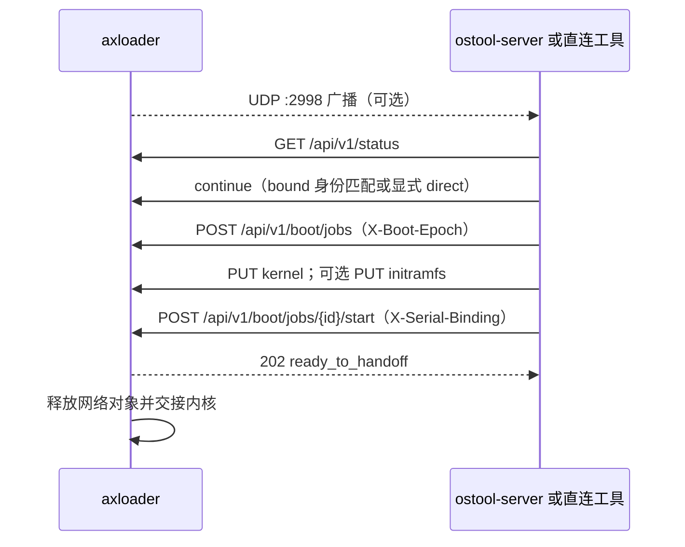

# axloader 网络控制与本地验证

## 1. 设备所有权

### 1.1 入口与发现

协议 v6 将 HTTP 控制入口放在 axloader。`network::Announcer` 在同一 UEFI 网卡
向 UDP `2998` 单向广播 MAC、架构、启动代次和设备 TCP4 端口 `2999`；
`direct::Listener` 在该端口处理启动与 OTA。ostool-server 的
`loader::serve_udp_discovery()` 对 v5/v6 广播调用 `device::reconcile()`，先反向
GET 设备状态，核对 MAC、代次和架构，才从板卡 TOML 中查找当前绑定。
发现不要求服务端响应：直连客户端知道设备 IP 时可独立控制装载器。
设备没有可写 ESP 或 OTA 状态区时，状态响应中的 `ota` 可以为空；服务端记录
告警并跳过升级决策，v6 设备已有 Session 的普通启动推送仍然可用。

广播和 HTTP 没有身份认证。MAC 仅作板卡配置绑定键；报文和镜像的 SHA-256
仅检验一致性，本阶段限定可信隔离实验网。服务器对重复 MAC 且不同来源 IP
的在线设备停止下发任务，新的启动代次替代同地址的旧实例；设备拒绝旧代次的
修改请求。

### 1.2 启动交接

`BootServer` 在内存维护一个 `DeviceBootJob`。内核和可选 initramfs 由调用方
PUT 上传，各自按清单长度及 SHA-256 检验，每个文件不超过 256 MiB。cmdline
和 initramfs 相互独立且都可省略。`POST /api/v1/boot/jobs/{id}/start` 只接受
x86_64 ELF64 的 `__x86_64_efi_pe_entry`，把 cmdline 安装为 EFI LoadOptions，
并仅在归档存在时发布 TGOS `BootPayload` 配置表；回复 `ready_to_handoff` 后释放
TCP4、UDP4 对象和 UART 身份计时器，进入 UEFI 内核交接。
没有 ESP 写入或 ostool-server 时，同样可以从设备 IP 直连完成启动。


```mermaid
sequenceDiagram
    participant L as axloader
    participant S as ostool-server 或直连工具
    L-->>S: UDP :2998 广播（可选）
    S->>L: GET /api/v1/status
    S->>L: continue（bound 身份匹配或显式 direct）
    S->>L: POST /api/v1/boot/jobs（X-Boot-Epoch）
    S->>L: PUT kernel；可选 PUT initramfs
    S->>L: POST /api/v1/boot/jobs/{id}/start（X-Serial-Binding）
    L-->>S: 202 ready_to_handoff
    L->>L: 释放网络对象并交接内核
```

ostool-server 保留原有 Session、串口 WebSocket、启动清单和板卡租约。会话
上传文件后，`device::push_boot()` 从会话存储读取并重新核对长度与摘要，
再调用设备接口；它不把文件 URL 交给装载器。设备在同一 Session 内复位时，
服务器观察新启动代次并按原 `boot_id` 重新推送。串口在启动前承载本次身份帧，绑定后承载目标系统输出；每次上电都重新验证身份和参数。
若同一启动代次仍保留其他 `boot_id`，服务器在创建返回 `409` 后按状态中的旧 ID
删除该事务，再尝试创建一次；第二次仍冲突则停止本次推送，等待后续设备广播。

## 2. 设备协议

### 2.1 启动事务

所有修改调用携带当前 `/api/v1/status` 返回的 `X-Boot-Epoch`。
`BootServer::create()` 只接受 x86_64 ELF64、非空合法启动 ID、预期长度与
摘要、固定 EFI 入口，以及合法的可选命令行；相同 ID 和清单的重试保留已接收文件，
冲突清单返回 `409`。设备只保留一个启动事务，可在启动前取消。

| 方法与路径 | 结果 |
| --- | --- |
| `GET /api/v1/status` | 返回 v6、MAC、启动代次、串口参数/绑定、硬件、启动事务及 OTA 状态 |
| `POST /api/v1/serial/continue` | 当前 epoch 的 `serial_id`、`binding_id` 和 `bound/direct`；相同请求幂等 |
| `DELETE /api/v1/serial/bindings/{binding_id}` | 撤销当前匹配绑定，尚在装载器时恢复身份帧 |
| `POST /api/v1/boot/jobs` | 提交 `DeviceBootJob`；创建返回 `201`，幂等重试返回 `200` |
| `GET /api/v1/boot/jobs/{id}` | 查询事务阶段及已接收文件 |
| `PUT /api/v1/boot/jobs/{id}/kernel` | 原始内核，必须带定长和 `X-Image-Sha256` |
| `PUT /api/v1/boot/jobs/{id}/initramfs` | 原始可选归档，采用相同校验规则 |
| `POST /api/v1/boot/jobs/{id}/start` | 当前 epoch/绑定令牌通过、文件齐备且装载成功返回 `202` 并交接 |
| `DELETE /api/v1/boot/jobs/{id}` | 未交接时释放事务和文件 |

请求头限制 4 KiB；仅接受 `Content-Length`，连接空闲 30 秒后取消，短读和
错误摘要或上传中断释放启动事务。长时间接收过程中等待路径继续驱动 UDP 广播；单个设备
一次只处理一个 TCP 连接。需要同时上传或查询的客户端应等当前请求完成。

### 2.2 装载器升级

设备复用 `ota::OtaContext` 和现有 A/B 启动器：流式写入非活动槽，完成文件
摘要、PE 架构与 UEFI 加载校验后才持久记录待试升级并复位。待试槽未收到
相同升级 ID、相同来源的确认时拒绝内核启动；复位或加载失败由启动器回滚。

| 方法与路径 | 结果 |
| --- | --- |
| `GET /api/v1/ota/status` | 当前槽、摘要、待试 ID 与最近结果 |
| `PUT /api/v1/ota/image` | 32 MiB 以内的原始 EFI，`X-Image-Sha256` 必需，成功返回 `202` 并复位 |
| `POST /api/v1/ota/confirm` | JSON 升级 ID；只有对应待试槽可以持久提交 |

直连上传默认生成 ID，且来源为 `direct`。服务端指派传入持久任务 ID，
以及 `X-Update-Source: server`；`OtaStore::decide()` 只在板卡空闲且非其他
待试升级时下发。新槽广播后，服务端核对当前板卡绑定、升级 ID、运行摘要与
来源，才调用确认接口；此确认不受板卡租约状态限制，活动 Session 可以在确认
解锁后继续启动。设备持久提交后服务器任务变为成功。服务重启读取独立
于 Session 的镜像库和任务。直连升级不会被服务端自动确认。
服务端只向配置为 x86_64 UEFI HTTP 的板卡指派当前 AMD64 EFI 镜像；配置省略
`boot_arch` 时沿用现有 CLI 语义，按 `x86_64` 处理。设备拒绝
镜像或传输失败时，任务持久记录错误和投递次数；连续三次失败后进入 `failed`，
不再重复传输完整镜像。同一阶段的设备回报按幂等请求处理。
管理端可删除没有被非终态任务引用的镜像；终态任务保留自身的摘要、版本和长度，
因此删除文件不破坏历史任务记录。镜像上传和删除通过同一目录门闩串行，元数据
列表在启动时载入内存并只在增删成功后更新；这既避免 SSE 快照重复扫描目录，也
防止并发上传、删除或指派留下只有元数据、只有 EFI 文件或悬空任务的可见状态。

## 3. 内建 QEMU 虚拟板

虚拟板默认关闭，当前固定使用 `x86_64 + OVMF + q35 + TCG`。示例服务端配置：

```toml
[loader_network]
enabled = true
bind_addr = "0.0.0.0:2998"
public_base_url = "http://10.77.0.1:2999"

[virtual_qemu]
enabled = true
qemu_binary = "/usr/bin/qemu-system-x86_64"
ovmf_code = "/usr/share/OVMF/OVMF_CODE_4M.fd"
ovmf_vars = "/usr/share/OVMF/OVMF_VARS_4M.fd"
axloader_efi = "/opt/ostool/BOOTX64.EFI"
runtime_dir = "/var/lib/ostool-server/qemu"
network_namespace = "ostool-qemu"
bridge = "ostool-br0"
tap_pool = ["ostool-tap0", "ostool-tap1"]
memory_mib = 512
cpus = 2
```

相对路径按配置文件目录解析。`virtual-lab` 需要创建 network namespace、veth、
bridge、TAP 和 dnsmasq，应以具备 Linux `CAP_NET_ADMIN` 的身份运行：

```bash
ostool-server --config /etc/ostool-server/config.toml virtual-lab up
ostool-server --config /etc/ostool-server/config.toml virtual-lab status
ostool-server --config /etc/ostool-server/config.toml virtual-lab down
```

默认客户机网段为 `10.77.0.0/24`，服务端地址为 `10.77.0.1`，dnsmasq/bridge
地址为 `10.77.0.254`，DHCP 池为 `10.77.0.100-200`。三个子命令均可重复调用。
管理页面启动虚拟设备后，QEMU 必须通过真实 UDP 广播和设备 HTTP 接口出现在
未绑定列表。绑定时 MAC 和电源配置必须引用同一个虚拟设备；串口 provider 从电源取得，板卡不保存串口配置：

```toml
[network_identity]
mac_address = "02:aa:bb:cc:dd:ee"

[power_management]
kind = "qemu"
virtual_device_id = "<virtual_device_id>"

[boot]
kind = "httpboot"
boot_arch = "x86_64"
```

`VirtualBoardManager` 持有 QEMU 子进程、TAP、独立 OVMF VARS、QMP socket 和
串口 hub。`On`/`Off` 幂等；关闭先发送 QMP `quit`，超时后才终止进程。串口
hub 保留最近 64 KiB 输出并跨 QEMU 重启，新实例广播新的启动代次。

验收顺序如下：

1. 启动未绑定 QEMU，确认它通过真实发现出现在管理页面。
2. 填写板卡 ID、类型和 QEMU 电源，并选择探测到的 MAC。
3. 使用 `ostool` 创建 Session、上传内核及可选 initramfs/cmdline，确认设备 HTTP 交接和内核串口标志。
4. 保持 WebSocket 和 Session，执行虚拟板 `Off -> On`，确认新启动代次重新取得相同启动事务并再次交接。
5. 关闭 WebSocket，确认 Session 经 `releasing` 回到 `idle` 且 QEMU 退出。
6. 新建 Session 再运行一次，全程不修改绑定。

## 4. 兼容与本地联调

### 4.1 兼容边界

ostool-server 保留 v5 的设备识别与 OTA，以及 v2/v3/v4 的旧识别和升级入口。
自动启动要求 v6，旧装载器在启动前收到明确升级错误，不回退手工串口。
`PROTOCOL_VERSION` 继续标识旧 poll 路径，`DEVICE_PROTOCOL_VERSION` 为 6。
TGOS 与 ostool 共用正式版本 `httpboot-protocol 0.5.0`；发布前本地联合验证通过
忽略的 Cargo patch 指向协议工作树，正式交付先发布协议和 `ostool-serial 0.1.0`，
再更新 registry 锁文件。升级前排空 session，串口定位只在 RAM 保留。

串口 channel、独占租约、原始参数恢复、继电器排除和错误恢复的代码边界见
[串口所有权](axloader-serial-ownership.md)。U-Boot 继续使用手动串口配置与原步骤。

### 4.2 隔离测试

`ostool-server/scripts/test-axloader-local.py` 调用隔离的 `qemu_serial` 集成测试，
运行真实 ostool-server router、HTTP/WebSocket 监听和 OVMF/QEMU。在临时目录
创建服务存储、OVMF VARS 和 ESP；私有 PTY provider 不枚举或打开实体串口。
QEMU UART 字节原样经过 PTY，`hostfwd` 指向真实客户机 TCP4；夹具直接把已核对
的设备公告地址映射到本地端口，不模拟 UART 身份或设备 HTTP。

Session 配置为 `serial: null`，server 必须自动匹配 UART、应用上报参数、确认
并上传真实 ArceOS UEFI ELF。成功条件来自 WebSocket 中的身份帧和内核
`HOST_CMDLINE`、`HOST_INITRAMFS_PASSED`、`Hello, world!`；退出后等待真实租约归还。
默认使用 TGOS axloader QEMU 测试产物，也可用 `--kernel`、`--initramfs` 指定。

```bash
cargo build -p ostool-server
python3 ostool-server/scripts/test-axloader-local.py --tgos /path/to/tgoskits-dev
```

TGOS 单仓用 `cargo xtask axloader test qemu --target x86_64-unknown-uefi` 验证
同一真实 FAT 映像上的直连启动、镜像升级、坏摘要、短请求、待试复位和持久确认。
本地测试不调用安装、更新或 systemd 脚本，不连接 runner，也不刷写实体板卡。
`hostfwd` 证明本地真实 HTTP 反向调用；隔离测试不证明实体网络广播与反向路由；后者
属于日后上线前的单独验收。
