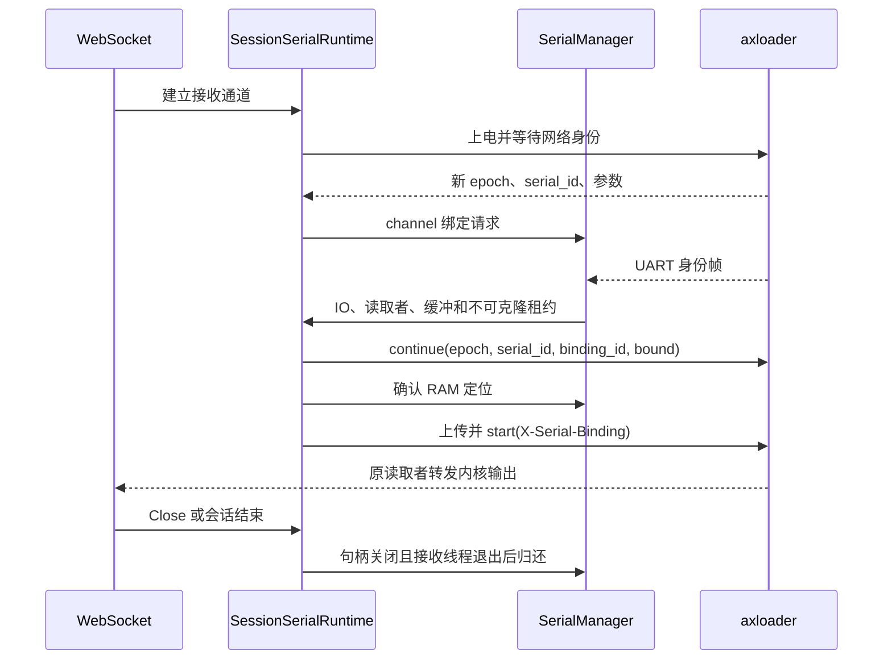

# axloader 串口发现与会话所有权

## 1. 启动身份

`httpboot-protocol::LoaderSerialStatus`、`SerialParameters` 和 `SerialBinding` 定义 v6 的设备契约。设备每次上电产生新的 `boot_epoch` 和 32 位小写十六进制 `serial_id`。MAC 用于选择板卡，UART 身份帧用于证明物理连线；SMBIOS 序列号和 USB SN 均不是启动身份。

### 1.1 设备参数

`SerialBeacon` 从 `ConOut` 对应的唯一 `SerialIo` 读取生效参数。固件无法读取某个参数时使用 UEFI 常见默认值 115200/8N1、无硬件流控，并在状态中保留诊断；无法唯一选择 UART、没有协议或宿主后端不能表示的参数仍明确失败。Web UI 可选保存一组宿主侧参数覆盖，覆盖优先级高于本次 axloader 上报；默认不配置。

| 字段 | 含义与约束 |
| --- | --- |
| `baud_rate` | 生效速率；宿主检查 u32 范围、驱动设置结果及读回值 |
| `data_bits` | ASCII 身份帧支持 7 或 8 位 |
| `parity` | none/odd/even/mark/space；当前宿主驱动拒绝 mark/space |
| `stop_bits` | one/one_point_five/two；当前宿主驱动拒绝 1.5 位 |
| `flow_control` | none 或 rts_cts；不复制瞬时 CTS 信号 |

设备不报告宿主读取超时或缓冲大小。`NativeBackend` 保留自己的 20 ms 读取期限、缓冲和调度方式，设置后核对驱动读回值；参数不符不能继续启动。

### 1.2 网络门禁

HTTP 和 UART 就绪后，固件每 250 ms 尝试发送 `\r\nAXLOADER-SERIAL/1 <serial_id>\r\n`。`POST /api/v1/serial/continue` 使用当前 `X-Boot-Epoch` 和 `SerialBinding`，相同请求幂等，冲突请求拒绝。启动还需 `X-Serial-Binding`。上传、查询和 OTA 不受串口门禁限制。

`bound` 表示已经由宿主身份匹配并接管串口；`direct` 是直连客户端显式放行，没有串口隧道。`DELETE /api/v1/serial/bindings/{binding_id}` 只能撤销当前代次的匹配令牌；设备还在 axloader 时恢复发送身份。服务器取消请求或启动失败时，以代次和令牌进行有期限的尽力撤销。

## 2. 单一资源所有者

`AppState::serial_manager` 创建唯一 `ostool-serial::SerialManager`。共享组件不依赖 Axum。CLI 使用相同组件创建本地管理器；服务器中的会话、手动 U-Boot 串口和继电器操作均通过管理器协调端口。

### 2.1 发现与缓存

`BindRequest` 携带所有者、请求代次、MAC、启动代次、身份、参数和截止时间。`Discovery` actor 串行处理 channel 消息，端口枚举与打开在独立任务执行，避免阻塞取消和继电器保留请求。

有 RAM 定位时先按本次参数验证对应口 1 秒；失败清除定位后进入共享发现。多个请求共享候选 IO 和读取者；并行打开的端口按规范化路径去重。参数组合去重后每 1 秒轮换。每次管理器绑定请求的扫描期限是 `max(5 秒, 组合数 × 2 秒)`，不超过该请求剩余期限。服务端设备等待上限为 60 秒；每次收到同一启动代次的有效设备报告（包括可恢复的 `ready=false` 或参数错误）都会刷新这个窗口。单次扫描没有身份帧时释放候选并返回可恢复错误，不无限占用串口。

`SerialLease::confirm()` 只在网络确认成功后提交 `MAC → PortLocator`。缓存不包含启动 ID、绑定令牌或句柄；session 结束保留定位，读写/验证出错清除定位，进程重启全部丢失。缓存每次仍须匹配新启动身份。

### 2.2 租约移交与释放

发现阶段拥有整个 IO、唯一接收线程和输入缓冲。匹配后 `SerialLease` 整体移动给 `SessionSerialRuntime`，不重新打开，不清空缓冲，不创建第二个读取者。身份帧紧跟的内核输出仍通过原读取者交给 WebSocket。



`SerialLease::drop()` 在阻塞回收任务中关闭 IO，等待接收线程退出，然后发送带租约 token 的 Release。`wait_owner_released()` 等实际归还，不能用 WebSocket 的布尔状态替代。最后一个发现请求退出后，全部未出租候选关闭，迟到打开结果也先关闭再解除保留。

### 2.3 继电器与候选设置

全部板卡的 `ZhongshengRelay` 配置被转成 `PortSelector`，覆盖 SN、by-path 和规范化路径。配置保存前安装新排除集合并等待冲突候选关闭；保存失败恢复原集合。临时电源操作先 `reserve_power_serial()`，待 IO 完成再释放保留。已有 session 或 U-Boot 租约不能被发现抢占。

独占打开失败跳过。发现只读取身份，不发送探测命令，不以 DTR/RTS 切换探测。未绑定候选和归还的租约恢复原始线设置；Linux 保存 `termios2`，包含任意速率的实际值。短时打开、设置和读取仍可能影响不遵守独占机制的外部程序；“可打开”不等于“无干扰”。本地 CLI 无法获知另一服务器的未使用继电器配置，应在与实验设备对应的宿主运行，使用中的独占口会被跳过。

## 3. 会话与界面

`serial_connected` 只表示 WebSocket 已建立。实际 UART 状态由 `SerialRuntimeStatus` 表示；UI 经现有 SSE 订阅 `sessions` 和 `serial_manager`，展示参数、端口、状态、错误、发现请求数和候选数。`Recovering` 可能仍保留待重新验证的实时租约，此时端口和同一启动代次的绑定令牌继续展示；没有实时租约时才清空端口和令牌。

### 3.1 上电与错误恢复

上电或下电递增会话启动代次，取消旧绑定、网络确认和启动任务。现有租约可保留，但新启动必须重新读取参数并验证新 ID。等待绑定时仍处理 Close、Ping、心跳和取消。

串口读写错误清除定位并重新申请。已确认绑定的设备仍在 axloader 时，下一次网络协调撤销旧令牌，使身份帧恢复。已经进入内核而没有新的身份帧时，恢复等待最多 5 秒后失败并执行原会话清理；不会主动断电重启内核。

### 3.2 配置和命令

axloader 表单隐藏串口开关和 SN/path，保存 `serial: null`；“指定串口参数”是可选的持久化覆盖，未配置时使用本次上报或固件默认值。编辑时切回 U-Boot 保留手动字段草稿。QEMU 的 provider 来自电源配置的虚拟设备 ID；仍必须解析实际身份帧。U-Boot 保留原手动串口和启动步骤。

```bash
ostool axloader run --device http://DEVICE:2999 --kernel kernel.elf \
  --initramfs initramfs.cpio --cmdline 'console=ttyS0'
ostool axloader continue --device http://DEVICE:2999
```

`run` 自动配置本地口并输出串口，在交互终端转发键盘输入；Unix 非交互模式只输出，沿用现有终端行为。CLI 对设备状态和管理器绑定请求使用 60 秒总等待期限；每次请求的串口扫描仍按 `max(5 秒, 组合数 × 2 秒)` 结束，遇到 `ready=false`、扫描超时或发现失败会重新读取状态并发起下一次请求。交互输入复用 `sterm::Input` 的可取消非阻塞读取，不留下等待换行的工作线程。Ctrl-C 归还租约，尚在装载器时尽力撤销绑定。`continue` 只执行 direct 放行，调用方随后上传和启动时仍须带设备状态中的匹配令牌。

## 4. 验证与迁移

管理器确定性交错测试覆盖多请求共享、身份隔离、迟到打开回收、继电器别名排除、定位复用、新参数及重启丢缓存。实际 PTY/HTTP/WebSocket 测试证明两次上电的无损移交和原设置恢复；QEMU 验证真实固件身份和真实内核输出。

### 4.1 可复现入口

ostool 使用相关 crate 测试、Clippy、server 构建和 pnpm 测试、构建、Playwright。QEMU 的隔离夹具只列出其私有 PTY，逐字节转发 OVMF UART 并把 guest TCP4 映射到 hostfwd；不接触系统服务或实体串口。

```bash
cargo test -p httpboot-protocol -p ostool-serial -p ostool-server
cargo clippy -p httpboot-protocol -p ostool-serial -p ostool-server -p ostool --all-targets -- -D warnings
python3 ostool-server/scripts/test-axloader-local.py --tgos /path/to/tgoskits-dev
```

TGOS 使用 `cargo fmt --package axloader --package axbuild`、`cargo xtask clippy --package axloader --package axbuild` 和 `cargo xtask axloader test qemu --target x86_64-unknown-uefi`。实体板卡的首次/再次上电、新会话、参数变化、重启与未使用端口释放需要单独验收；本地模拟不证明实体 USB 驱动或实验网路由。

### 4.2 发布顺序

设备协议依赖版本为 `httpboot-protocol 0.5.0`，共享组件为 `ostool-serial 0.1.0`。先审查并发布协议，再发布组件及 ostool，更新 TGOS 的 registry 锁文件后再协调升级。开发验证可用 Cargo 本地 patch，但不得把开发机器的路径依赖作为正式交付。

维护窗口先排空 session。server 保留 v5 识别与 OTA，旧 poll 设备仍可识别和升级，但自动启动明确要求 v6；不提供手动串口回退。启动身份和定位不持久化，重启后再次进入 axloader 才能绑定。当前验证范围是 x86_64 UEFI、Linux 宿主和可信实验网络；部署、实体板卡刷写和新架构支持独立授权。

### 4.3 本次本地验收记录

2026-10-08 的实现基于 TGOSKits `dev@135ad7af001a64d78d6b950411bc786a1c9221d7` 和 ostool `main@bbc9d08d75b750acbf37538220cae43de5e74a09`。以下结果来自当前开发工作树及协议本地 patch，尚不是发布版本或远程持续集成结论。最后同步的 `135ad7af00` 只修改无关的 Starry AIO 测试，不影响已验证的 axloader 和 ArceOS 启动路径。

| 验证 | 结果与证据边界 |
| --- | --- |
| 协议、管理器与 server | 协议 8 项、共享串口 6 项、server 单元 163 项，以及 PTY/HTTP/WebSocket、网络和会话集成均通过 |
| 回归敏感度 | 同一测试在跳过可支持参数、错误 USB 身份匹配、以电源就绪阻塞 WS 接收的实现上失败，恢复修复后通过 |
| 静态与构建 | 两仓库定向格式化、相关 crate Clippy、server 构建通过；TGOS Clippy 包含真实 UEFI 目标 |
| 固件启动与 OTA | 项目 QEMU 套件通过真实身份、bound/direct 门禁、四种内核载荷组合、真实 FAT OTA、试运行回滚和持久确认 |
| 自动隧道装配 | 独立 OVMF → 原样 UART → 私有 PTY → server HTTP/WebSocket → ArceOS，确认身份、参数、内核输出和 initramfs/cmdline |
| UI | 28 项单元测试、构建、2 项浏览器旅程通过，核对自动串口区、草稿、焦点、滚动和窄屏 |
| CLI | 330 项库测试通过，包含复用输入读取器的取消与标志恢复；`run` 命令入口构建通过，本地 HTTP 契约夹具验证 direct continue 可重复且无需 UART，实际 USB `run` 尚待板卡联调 |

实体板卡、生产 UDP/netns 路径、非 Linux 宿主、正式依赖发布后的 registry 构建和最终提交持续集成尚未验收。协议与共享组件发布后，应去掉开发 patch，重新生成 registry 锁文件，再进行维护窗口升级。
